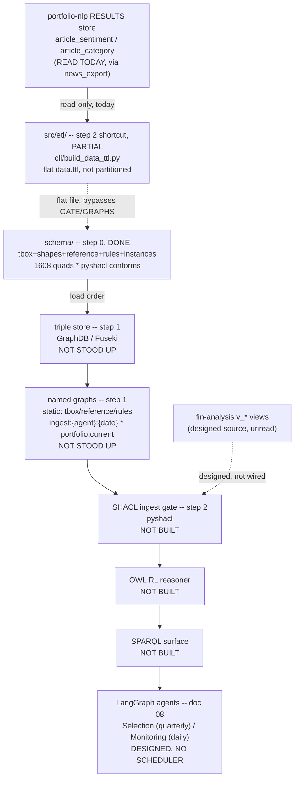

# SPEC.md — `portfolio-knowledge-graph`

Part of the thesis *"Sistema inteligente para la optimización de la inversión
en portafolios mediante integración de información financiera estructurada y
no estructurada de acciones del S&P500"* — Gabriel Jaime Múnera González &
Dovaribi Carupia Yagari, Universidad Pontificia Bolivariana (UPB). Referred
to elsewhere in this document and the architecture artifacts by its working
nickname, "Portfolio Thesis."

The technical contract for this repository: requirements, architecture, data
model, and acceptance criteria. Where `.specify/memory/constitution.md` is
the philosophy/principles/code-style layer this repo commits to regardless of
feature, this document is the "what, precisely" layer for the system it
implements — every requirement below should be traceable to a test, and every
design decision should be explainable by a principle in the constitution.
Link liberally: a design choice justified by, e.g., the constitution's
Architecture or Security & Data principles is annotated `(constitution: …)`
below rather than re-argued here.

Requirement IDs (`FR-0xx` functional, `NR-0xx` non-functional) are stable —
don't renumber an existing one, even if it's later superseded; mark it
superseded in place instead. Reference them in commits/PRs/tests
(`test_two_tier.py::test_source_readonly  # FR-007`) so a reviewer can trace
implementation back to requirement and requirement back to test.

---

## 1. Overview & Purpose

`portfolio-knowledge-graph` is the semantic layer of a six-repository system
(the "Portfolio Thesis") that builds and maintains an S&P 500 portfolio on
top of a knowledge graph. Data flows in one direction through the system:

```
sources (Wikipedia/news/Finnhub/SEC EDGAR)
  → portfolio-data-mining      (acquisition: discovers URLs, extracts article text)
  → portfolio-nlp              (semantic layer: sentiment/NER/category/summaries)
  → portfolio-financial-analysis (fundamentals/pricing/cycle/quant → SEMANTIC score input)
  → portfolio-knowledge-graph   (THIS REPO — RDF/OWL projection + SPARQL evidence surface)
  → portfolio-reports          (as-of run engine, per-name evidence, HTML report)
  → portfolio-app                (thin Streamlit client)
```

with one feedback edge running back up (a user-defined decision criterion,
compiled once in `reports` and propagated into `financial-analysis` and the
knowledge graph) — out of scope for this repo, noted here only for context.

**What this repo is for**: a portfolio decision needs one auditable place
that ties every signal — universe membership, fundamentals, sentiment, risk
events, veto outcomes, portfolio history — back to *why* it's true and *when*
it became true. `portfolio-knowledge-graph` defines and hosts the formal
RDF/OWL/SHACL ontology (`schema/`) every other repo's data is meant to be
projected into (roadmap step 0, done), the named-graph topology and reasoning
profile that makes that projection queryable and bitemporal
(`07-ontology-topology.md`, designed), and — as a first, narrower cut ahead of
the full projection (roadmap step 2, partially begun) — an ETL
(`src/etl/`) that turns Wikipedia's S&P 500 constituent table plus
`portfolio-nlp`'s already-published sentiment/category results into a
single-shot, flat `data.ttl` load, so that the ontology has *some* real data
to validate against before the target architecture (a standing triple store,
a SHACL ingest gate, an OWL RL reasoner, a SPARQL surface) is built out.

**What this repo is explicitly not**: it does not compute fundamentals,
pricing, cycle rankings, or quant scores (`portfolio-financial-analysis`'s
job); it does not run any NLP model or own article source text — it reads
only `portfolio-nlp`'s already-published RESULTS rows, read-only, never
`portfolio-nlp`'s SOURCE text or its own model inference; it does not (yet)
stand up a triple store, a SHACL ingest gate, an OWL reasoner, a SPARQL
surface, or the two LangGraph agent cycles that are meant to read all of the
above (`08-agent-architecture.md`, designed but unbuilt — roadmap steps 1 and
3–8); it makes no portfolio or trading decision and renders no report
(`portfolio-reports`/`portfolio-app`'s job).

## 2. Scope & Requirements

### 2.1 In scope

- The formal ontology bundle in `schema/`: `tbox.ttl` (37 classes — 24
  mutually-disjoint leaves under a 13-class `rdfs:subClassOf` backbone),
  `shapes.ttl` (14 SHACL node shapes), `reference.ttl` (GICS taxonomy + 5
  worked-example assets + the `MetricType` vocabulary), `rules.ttl` (a
  7-rule veto catalog as `RuleClause` trees + `AttractivenessWeightScheme`),
  `instances.trig` (a 12-named-graph worked-example ABox) — roadmap step 0,
  done and verified (**1608 quads, `pyshacl` conforms: True**).
- The five numbered architecture/spec docs (`06`–`10`) plus
  `critique-and-evolution.md` as the traceability anchor every class/
  property/graph-placement decision elsewhere cites back to.
- The step-2 ETL (`src/etl/`, entry `cli/build_data_ttl.py`): Wikipedia's
  S&P 500 table → `:Asset`/`:classifiedAs` (the full ~503-constituent
  universe, minus tickers `reference.ttl` already declares) + `portfolio-nlp`'s
  RESULTS store (via `portfolio_common.news_export`, read-only) →
  `:NewsArticle` / `:ScoreSnapshot` (Sentiment) / `:RiskEvent` (gated) — a
  single-shot flat `data.ttl`, not the named-graph-partitioned target
  architecture.
- Keeping the schema and its companion docs internally consistent: the exact
  class/shape/graph/quad counts asserted in `06`/`07` and `schema/README.md`
  must stay in sync with `tbox.ttl`/`shapes.ttl`/`instances.trig` after any
  edit — validated by the parse-and-conform check below.

### 2.2 Out of scope

- Standing up a triple store (GraphDB/Fuseki) — roadmap step 1.
- The SHACL ingest gate, dated named-graph partitioning
  (`ingest:{agent}:{date}`), OWL RL reasoning, and the SPARQL query surface —
  designed in `07`/`08`, not built (roadmap steps within 1–2 and beyond).
- Computing fundamentals, pricing, cycle rankings, or quant scores
  (`portfolio-financial-analysis`).
- Running any NLP model, discovering/crawling article URLs, or reading
  article `body_text` (`portfolio-data-mining`/`portfolio-nlp`) — this repo
  only ever reads `portfolio-nlp`'s already-published RESULTS tables,
  read-only.
- The two LangGraph agent cycles (`SelectionCycleGraph` quarterly,
  `MonitoringCycleGraph` daily) — designed in `08-agent-architecture.md`, no
  scheduler exists.
- SEC EDGAR filings/sections, pricing/trading data, `:Executive` individuals,
  `article_summary`/`sector_summary` ingestion, and entity extraction beyond
  sentiment/category — all explicitly excluded from the current ETL phase
  (`src/etl/README.md`'s scope table).
- Backtesting (roadmap step 9) and any UI (`portfolio-app`) or report
  rendering (`portfolio-reports`).

### 2.3 Functional requirements

| ID | Requirement | Acceptance criteria |
|---|---|---|
| **FR-001** | The `tbox.ttl`/`shapes.ttl`/`reference.ttl`/`rules.ttl`/`instances.trig` bundle parses as a single `rdflib.Dataset` in the documented load order and `pyshacl`-conforms against `shapes.ttl`. | The `schema/README.md` parse script reports `quads: 1608`; a `pyshacl.validate` run over the same combined graph reports `conforms: True` — both required after any schema edit. |
| **FR-002** | Every domain class in `tbox.ttl` that is not a shared-property superclass (`ObservationSnapshot`/`EvidenceSource`/`RuleOperand`) belongs to exactly one `AllDisjointClasses` set and reaches at least one of the 6 taxonomy roots via `rdfs:subClassOf`. | `tbox.ttl`'s `AllDisjointClasses` block lists exactly 24 leaf classes; a taxonomy audit (cycle/orphan/multi-parent detection over the `subClassOf` graph) reports 0 cycles, 0 self-loops, all 37 classes reaching a root, exactly 3 legitimately multi-parented classes (`schema/README.md`'s implementation addendum). |
| **FR-003** | Every `RuleDefinition` in `rules.ttl` expresses its veto condition as an explicit `RuleClause` tree (`AND`/`OR` of `ThresholdComparison`/`CategoricalComparison`/`GraphPredicate` leaves), never as an infix boolean string. | No `RuleDefinition` in `rules.ttl` carries a rule condition as a literal string to be re-parsed; every `hasClause` path terminates in one of the three documented leaf operand kinds. |
| **FR-004** | `cli/build_data_ttl.py` projects the Wikipedia S&P 500 table into `:Asset`/`:classifiedAs` individuals, skipping any ticker `reference.ttl` already declares as an `:Asset` (so `cikNumber` never collides under the functional-property `sh:maxCount 1` contract). | A full run's known-ticker count equals the fetched Wikipedia row count minus `reference.ttl`'s worked-example tickers; none of those tickers appear as a second `:Asset` declaration in `data.ttl`. |
| **FR-005** | `cli/build_data_ttl.py` projects `portfolio-nlp`'s RESULTS rows (`articles ⋈ article_sentiment ⋈ article_category`, `fetch_status = 'ok'`) into `:NewsArticle` + `:ScoreSnapshot` (`agentOrigin = SEMANTIC`, `metricType = Sentiment`) + a gated `:RiskEvent`, via `portfolio_common.news_export`'s read-only connect — never a raw `sqlite3` connection and never `portfolio-nlp`'s SOURCE `body_text`. | `grep -rn "import sqlite3\|body_text" src/etl` returns nothing; every `:NewsArticle` emitted in a sample run traces to a source row with `fetch_status = 'ok'`. |
| **FR-006** | The post-build validation step SHACL-checks either the full output (`--limit` given) or a fresh `KG_SAMPLE_NEWS_ROWS`-row sample against the real `tbox.ttl` + `shapes.ttl` + `reference.ttl` — never a full `pyshacl` pass over the unsampled, multi-million-triple `data.ttl`. | `uv run cli/build_data_ttl.py --limit 500` prints `SHACL conforms: <bool>`; an unsampled default run builds and discards a `KG_SAMPLE_NEWS_ROWS`-row sample file rather than validating `data.ttl` directly. |

### 2.4 Non-functional requirements

| ID | Requirement | Acceptance criteria |
|---|---|---|
| **NR-001** | The ontology's and its companion docs' asserted counts (class/shape/graph/quad totals) stay in sync after any schema edit. | `schema/README.md`'s stated counts match a fresh run of the FR-001 parse+`pyshacl` check; a PR changing `tbox.ttl`/`shapes.ttl`/`instances.trig` without updating the doc's numbers is incomplete. |
| **NR-002** | A database-engine change (away from SQLite, or a `portfolio-common` results-contract bump) must not require touching this repo's ETL logic beyond a version/tag bump. | `grep -rn "import sqlite3" src` returns nothing; the only engine-specific access goes through `portfolio_common.db`/`portfolio_common.news_export`. |
| **NR-003** | Raw OHLCV/tick-level price data never enters the ontology or the ETL output (`07-ontology-topology.md`'s explicit warning). | `tbox.ttl` defines no tick-level price class; `grep` for a raw-bar/tick field name in `schema/` or `src/etl/` returns nothing beyond the bounded `PriceObservation` summary class. |
| **NR-004** | The IRI namespace stays `https://thesis.local/kg/portfolio#` for every new term across `schema/*.ttl`/`.trig` unless deliberately aligning to an external vocabulary. | A bare `owl:Class`/`owl:ObjectProperty`/`owl:DatatypeProperty` declaration outside that namespace, excluding the documented FIBO `rdfs:seeAlso` and GICS `skos:Concept` alignments, does not occur. |
| **NR-005** | The only automated gate is the `rdflib` parse + `pyshacl` conformance check (FR-001) — there is no `pytest` suite and no CI workflow configured today. | The parse+`pyshacl` script passes locally before merge; this NR exists so the absence of a test suite/CI is a documented decision (§14), not an oversight a reader might mistake for one. |

## 3. Technology Stack & Architecture Decisions

Full stack and rationale: `.specify/memory/constitution.md` §Technological
stock. Summary for traceability:

- **Runtime**: Python `>=3.12`, `uv`-managed (`uv.lock` committed,
  `package = false`).
- **Ontology tooling**: `rdflib>=7.0` + `pyshacl>=0.26` — the entire
  ontology-specific dependency surface; no triple-store client library yet
  (none is stood up).
- **ETL config**: `python-dotenv`, loading a repo-root `.env` at
  `src/etl/config.py` import.
- **Storage (ETL only)**: SQLite, two-tier SOURCE (`urls.db`)/RESULTS
  (`nlp.db`), accessed exclusively through
  `portfolio_common.news_export.connect_readonly`/`fetch_processed_articles`
  (git-tag-pinned `portfolio-common @ v1.2.0`) — no raw `sqlite3` anywhere in
  `src`/`cli` (NR-002).

Architecture decisions this repo has already made and should not be
re-litigated without a constitution amendment:

- **OWL (`tbox.ttl`) and SHACL (`shapes.ttl`) are deliberately both
  present** — OWL is open-world (what can be *inferred*), SHACL is
  closed-world (what an ingestion pipeline *rejects*). Don't collapse one
  into the other.
- **The current ETL output is a flat, non-partitioned file, a deliberate MVP
  shortcut — not the target architecture.** `07-ontology-topology.md`'s
  named-graph partitioning (`ingest:{agent}:{date}`, bitemporal audit trail)
  applies to a future, standing-triple-store load; `data.ttl` has none of
  that today (§13).
- **The `RuleClause` tree replaces v1's infix rule strings structurally, not
  just by convention** — every confluent veto rule in `rules.ttl` is
  `AND(primary_signal, OR(secondary_signals))` as an explicit tree.
- **The ETL depends on `portfolio-common` for the DB engine and the shared
  `news_export` read-only join only, never by vendoring a duplicate query
  when a shared one exists.** A local copy of `portfolio-nlp`'s
  `fetch_processed_articles` was carried temporarily (`portfolio-common`
  v1.0.0, before `news_export` existed) and has since been retired in favor
  of the shared `portfolio_common.news_export` module (`portfolio-common`
  v1.1.0+) — see `docs/portfolio-common-v1-migration-plan.md` and
  `docs/portfolio-common-v1.2-engine-agnostic.md` for the full history.

## 4. System Architecture



**Reading this diagram**: the top row (`schema/` → store → named graphs →
SHACL gate → reasoner → SPARQL → agents) is the *target* architecture from
`07`/`08` — only `schema/` is built. The `src/etl/` shortcut at the bottom is
what actually runs today: it reads `portfolio-nlp`'s RESULTS store directly
and writes a flat `data.ttl` that loads on top of `schema/` but bypasses the
named-graph/SHACL-gate/reasoner chain entirely — a narrower, working stand-in
for the step-2 projection `07`/`08` designed, not that projection itself
(§13).

Full detail, with hover tooltips per component, gap list, and plan: [the
repository artifact](https://claude.ai/code/artifact/d5d59284-9565-4bf6-8a54-3d2d1549863f).
System-level placement of this repo among the other five: [the architecture
overview](https://claude.ai/code/artifact/d3865a63-2894-4e20-b38a-7e50cf0d4040).

## 5. Data Model

Authoritative map: `schema/README.md`. File → named graph → format:

| File | Format | Named graph | Contents |
|---|---|---|---|
| `tbox.ttl` | Turtle | `urn:graph:tbox` | 37 classes (24 disjoint leaves + 13-class backbone), properties, cardinality restrictions |
| `shapes.ttl` | Turtle | `urn:graph:tbox` | 14 SHACL node shapes (the closed-world ingest gate) |
| `reference.ttl` | Turtle | `urn:graph:reference` | GICS sector/industry taxonomy + 5 worked-example assets + `MetricType` vocab |
| `rules.ttl` | Turtle | `urn:graph:rules:catalog` | 7-rule veto catalog as `RuleClause` trees + `AttractivenessWeightScheme` |
| `instances.trig` | TriG | 12 `GRAPH` blocks | Dated toy ABox: membership, snapshots, evidence, vetoes, filings, portfolio, rankings |
| `06`–`10` | Markdown | — | Ontology definition · topology · agent architecture · NLP pipeline · integration roadmap |

**ETL output** (`data.ttl`, git-ignored, not committed): a flat Turtle file
carrying `:Asset`/`:classifiedAs` for the S&P 500 universe (skipping
`reference.ttl`'s worked-example tickers) plus `:NewsArticle`/
`:ScoreSnapshot`(Sentiment)/`:RiskEvent` for `portfolio-nlp`'s already-scored
articles — see `src/etl/README.md`'s scope table for exactly what is and is
not projected this phase.

**Load order** into a fresh triple store, `data.ttl` last:
`tbox.ttl → shapes.ttl → reference.ttl → rules.ttl → data.ttl` (or
`instances.trig` in place of `data.ttl` for the worked-example ABox — the two
are alternatives, not both loaded together, since `data.ttl` re-derives a
subset of what `instances.trig` hand-authors).

**Known divergence** (schema decision, not a bug — §13): `ScoreSnapshotShape`
requires `normalizedScore` for every non-`SectorRelativeMomentum` snapshot,
but the ETL's Sentiment snapshots carry only `rawValue` — the scale the
veto-rule thresholds are defined on. The post-build SHACL check reports one
violation per Sentiment snapshot until a `rawValue`-only branch is added to
the shape or a normalization step is agreed.

## 6. Core Workflows

**Schema validation** (`schema/README.md`, run from inside `schema/`):

1. Parse `tbox.ttl → shapes.ttl → reference.ttl → rules.ttl` then
   `instances.trig` into one `rdflib.Dataset`; assert `quads: 1608`.
2. `pyshacl.validate` the same combined graph against `shapes.ttl`; assert
   `conforms: True`.
3. Run after **every** schema edit — `tbox.ttl`'s `AllDisjointClasses` block
   and every `sh:NodeShape` in `shapes.ttl` are asserted as exact
   counts/values in the design docs and will silently drift out of sync
   without this.

**ETL build** (`cli/build_data_ttl.py` → `etl.build_data_ttl.generate`):

1. Fetch the Wikipedia S&P 500 constituent table; read `reference.ttl` for
   the ticker skip-set.
2. Write `:Asset`/`:classifiedAs` for every non-skipped ticker
   (`etl.asset_master`).
3. Stream `portfolio-nlp`'s RESULTS store (via `portfolio_common.news_export`,
   `--limit`-bounded if given) into `:NewsArticle`/`:ScoreSnapshot`/
   `:RiskEvent` (`etl.news_to_rdf`), applying the provisional G1/G2/G3/G9
   formulas in `etl.common.severity`.
4. Unless `--no-validate`: SHACL-check the full output directly (smoke run,
   `--limit` given) or build-and-discard a `KG_SAMPLE_NEWS_ROWS`-row sample
   and SHACL-check that instead (full run — a full `pyshacl` pass over the
   unsampled multi-million-triple output is not practical).

## 7. Business Logic & Algorithms

- **Immutable observations, not mutable attributes**: a `ScoreSnapshot` is
  never updated in place — a new measurement is a new individual
  (constitution: Ontology design invariants #1).
- **Valid-time via `validFrom`/`validTo`**, absence of `validTo` meaning
  "still active" (`UniverseMembership`, `PortfolioPosition`,
  `RuleDefinition`).
- **N-ary relations reified as classes** whenever the relationship itself
  carries data — `UniverseMembership` is the template.
- **The `RuleClause` tree** makes v1's unparenthesized ∧/∨ precedence
  ambiguity structurally impossible — see `rules.ttl`'s worked examples for
  all three leaf-operand kinds.
- **Raw-vs-normalized comparison convention**: `Score*` metrics compare on
  `normalizedScore`; `Sentiment` compares on `rawValue` (§5's known
  divergence is this convention colliding with the SHACL shape's current
  wording, not a violation of the convention itself).
- **ETL projection formulas are provisional, not calibrated**
  (`src/etl/common/severity.py`):
  - **G1**: `rawValue = clamp(positive − negative, −1, 1)`.
  - **G2**: a 9-dimension `article_category` label maps to a 4-value
    `RiskEvent.category` bucket (`'other'` → no `RiskEvent`).
  - **G3**: a `creation_gate` (`negative ≥ 0.50` **or** `cat_score ≥ 0.70`)
    plus a severity ladder with a hard-trigger keyword bump; a
    category-confidence-only `RiskEvent` below every negative-sentiment tier
    maps to `LOW`.
  - **G9**: `publishedDate = pub_date`, falling back to `fetched_at` when
    `pub_date` is null; a row with neither is skipped.
  None of the four has a ground-truth calibration behind it yet (§13).

## 8. Error Handling & Resilience

- **`reference.ttl` stays authoritative for its own `:Asset`s**: any ticker
  it already declares is never re-emitted by the ETL, avoiding a
  `cikNumber` collision under the functional-property `sh:maxCount 1`
  contract once both files load (FR-004).
- **SHACL is the closed-world gate**, but today only exercised against a
  sample or a `--limit`-bounded smoke run (FR-006) — the full, unsampled
  `data.ttl` is never `pyshacl`-checked directly; a violation outside the
  sampled/limited slice would not be caught before load.
- **No per-row failure isolation is documented in the ETL** — unlike
  `portfolio-nlp`'s pipeline (which this repo's ETL reads from), there is no
  stated policy here for what happens if one malformed news row fails a
  projection step mid-run (§13, open question).
- **The two-tier connection** (SOURCE `urls.db` ATTACHed read-only, RESULTS
  `nlp.db`) is entirely `portfolio_common.news_export`'s responsibility —
  this repo neither opens nor manages that connection lifecycle directly
  (NR-002).

## 9. Performance & Scalability Expectations

This repo has no throughput/latency SLA, and defining one is out of scope
(§14) — a real-time or high-volume performance target belongs to a
production system this project isn't. What exists instead:

- **Scale estimates** for the target (unbuilt) triple-store architecture are
  in `07-ontology-topology.md`, not repeated here — they describe a system
  this repo has not yet stood up.
- **The ETL's `data.ttl` is git-ignored and can reach multiple million
  triples** at full S&P 500 + news-corpus scale; that scale is exactly why
  FR-006 validates a sample/limited run rather than the full output — no
  timing/throughput number for a full run is recorded here, since none has
  been formally measured (avoid inventing one, per §14's reasoning).

## 10. Testing Strategy & Acceptance Criteria

- **No `pytest` suite exists for this repo** (NR-005) — unlike
  `portfolio-nlp`, `src/etl/` has no hermetic unit tests for its severity
  formulas, ticker skip-set logic, or provenance-ID formatting; only the
  end-to-end SHACL sample/smoke check (FR-006) exercises it, indirectly and
  only for schema conformance, not for the correctness of the G1–G3/G9
  formulas themselves.
- **The parse + `pyshacl` conformance check (FR-001) is the actual gate**
  today, run manually before merge — see `.specify/memory/constitution.md`
  §Executable cmds.
- **Acceptance criteria in §2.3/§2.4 are the closest thing to a test spec**
  that exists — each row above is written to be directly checkable by
  inspection or the parse/`pyshacl`/`grep` commands cited, in the absence of
  an actual test suite.
- **New requirement → new test first** (once a test suite exists) is the
  aspirational standard this repo has not yet built infrastructure for — a
  `pytest` suite for `src/etl/` is accepted as permanently out of scope at
  current scale (§14), not a pending backlog item, unless Work item 4's
  larger projection changes that calculus.

## 11. Deployment Procedures

There is no CD pipeline and no CI workflow for this repo
(`.github/workflows/` is empty); what exists:

1. `uv sync`.
2. Configure `.env` (from `.env.example`) with at least `KG_URLS_DB`; the
   remaining `KG_*` variables have documented defaults.
3. Run the schema validation check (constitution §Executable cmds) after any
   `schema/` edit.
4. Run `uv run python cli/build_data_ttl.py [--limit N]` to (re)build
   `data.ttl` on demand — there is no scheduled or automated invocation.
5. No merge gate is enforced by CI today; `ruff`/`mypy`/`pre-commit` are run
   manually (constitution §Code & Git).

## 12. Dependencies & Integrations

- **Upstream (data, unpinned)**: Wikipedia's "List of S&P 500 companies"
  page, fetched live at ETL run time — no version/commit pin, no contract
  beyond the table's current column layout (`etl.asset_master`).
- **Upstream (data, read-only)**: `portfolio-nlp`'s RESULTS store
  (`article_sentiment`/`article_category`, `fetch_status = 'ok'`), read via
  `portfolio_common.news_export` — this repo pins no schema contract beyond
  that shared join's shape; a `portfolio-nlp` schema change could silently
  break the ETL (§13).
- **Upstream (library)**: `portfolio-common`, git-tag-pinned in
  `pyproject.toml` (`[tool.uv.sources]`, currently `v1.2.0`) — a DB-engine or
  `news_export` contract change here is an explicit, reviewed re-pin, never
  a floating version.
- **Downstream (intended, not yet built)**: a standing triple store, the
  SHACL ingest gate, the OWL RL reasoner, the SPARQL surface, and the two
  LangGraph agent cycles (`08-agent-architecture.md`) — designed to consume
  this repo's schema and, eventually, `financial-analysis`'s `v_*` views
  projected through it (roadmap steps 1–8, not started). `portfolio-reports`
  and `portfolio-app` sit further downstream still, per the six-repo diagram
  in §1.
- **No dependency on**: `portfolio-data-mining` (no direct read — this repo
  only reads `portfolio-nlp`'s already-processed output) or
  `portfolio-financial-analysis` (designed as a future source, not read
  today — see §13 item 2).

## 13. Open Questions & Risks

Carried forward from the last recorded architecture review ([the repository
artifact](https://claude.ai/code/artifact/d5d59284-9565-4bf6-8a54-3d2d1549863f))
and this document's own drafting — resolve or explicitly accept before
treating a related FR/NR as done:

1. **Roadmap steps 1–9 are entirely unbuilt.** No triple store, no SHACL
   ingest gate, no dated named-graph partitioning, no OWL RL reasoner, no
   SPARQL surface, no agent layer, no entity resolution or portfolio
   construction *in the graph*, no backtest. The compute layer §4 diagrams
   above the `src/etl/` shortcut is entirely unwritten.
2. **The designed step-2 projection (`financial-analysis`'s `v_*` views →
   dated named graphs, SHACL-validated on the way in) does not exist.**
   Today's `src/etl/` is a narrower, working stand-in: it reads only
   `portfolio-nlp`'s RESULTS store directly, bypassing
   `portfolio-financial-analysis` and named-graph partitioning entirely, and
   produces one flat file instead.
3. **`10-integration-roadmap.md` names superseded repos** —
   `news-collector`, `edgar_tool.py`, "a LangGraph agent layer" — that have
   since become `portfolio-data-mining`/`-nlp`/`-financial-analysis`, not yet
   rewritten in the doc itself.
4. **`schema/protege-view.ttl` predates later `tbox`/`reference`/`shapes`
   edits and has not been regenerated** — it needs an actual Protégé
   session, not a code change.
5. **This repo's local `CLAUDE.md` (untracked, gitignored) can lag
   `origin/master`.** ~~At the time this SPEC was drafted, a working checkout
   existed whose `CLAUDE.md` described the ETL as depending on a
   locally-vendored copy of `portfolio-nlp`'s `fetch_processed_articles`
   query against `portfolio-common` v1.0.0 — but `origin/master` had already
   merged two further PRs retiring that local copy in favor of
   `portfolio_common.news_export` and re-pinning to `portfolio-common`
   v1.2.0 (`docs/portfolio-common-v1.2-engine-agnostic.md`).~~ **Resolved for
   this checkout** (the constitution-compliance pass that also added
   `CLAUDE.md`'s required `.specify/memory/` references): `CLAUDE.md` now
   describes `portfolio_common.news_export`/`v1.2.0` correctly. The general
   risk of a *future* drift on some *other* checkout is unaffected by this
   fix and stays covered by constitution "Claude Code / coding-agent
   conduct" #2 — reconcile against `origin/master`'s actual `HEAD` before
   trusting `CLAUDE.md`'s dependency description in any given working copy.
6. **`ScoreSnapshotShape`'s `normalizedScore` requirement doesn't fit
   Sentiment snapshots** (§5's known divergence) — a documented schema
   decision producing one SHACL violation per Sentiment snapshot in the
   sample/smoke check today, not yet resolved either direction.
7. **No test suite exists for `src/etl/`** (NR-005/§10) — the severity
   formulas, ticker skip-set logic, and provenance-ID formatting are
   exercised only indirectly by the end-to-end SHACL check.
8. **The G1/G2/G3/G9 formulas in `etl/common/severity.py` are documented
   assumptions, not calibrated against ground truth** — see §7.
9. **No SOURCE/RESULTS schema contract is pinned beyond
   `fetch_processed_articles`'s join shape** — a `portfolio-nlp` schema
   change could silently break this repo's ETL with no signal.

## 14. Scope Boundaries

**This repository is a thesis/research artifact. Productizing it is not a
goal of this project and no production phase is planned.** Every requirement
and acceptance criterion above (§2–§13) describes and governs that scope
honestly — nothing above should be read as an implicit production-readiness
claim. Unlike a repo where most of §13 is a closed list of permanent
limitations, most of §13 here is this project's **actual unbuilt future
work** — `10-integration-roadmap.md`'s steps 1–9 are a real, intended
roadmap, not a wishlist that was decided against. This section therefore
splits §13's items into two genuinely different categories, and only the
second one is "out of scope, not deferred":

- **Pending development** — real, intended future work, tracked at the
  work-item level in `PLAN.md` even where a work item is coarse-grained or
  blocked on a scope/architecture decision. Not built yet is not the same as
  not planned.
- **Permanently out of scope** — a production concern this thesis project
  will never need regardless of how much of the roadmap gets built; listed
  here so its absence reads as a deliberate boundary, not an oversight.

### What this stage validates

Per §2.3/§2.4 and the design rationale in §7, this repo currently validates:

- **Schema well-formedness and closed-world conformance** of the ontology
  bundle (FR-001/NR-001) — parse success plus `pyshacl` conformance, not a
  correctness claim about the domain model itself.
- **Feasibility of a narrow, working projection** from one upstream source
  (`portfolio-nlp`'s RESULTS store) into the ontology's shape (FR-004/005/
  006), ahead of building the full target architecture.
- **Structural correctness of the `RuleClause` tree design** (FR-003) — that
  every veto condition is unambiguous by construction, independently of
  whether any particular rule's thresholds are well-calibrated.

### What this project explicitly does not do (permanently out of scope)

None of the following exist today, none are assumed by any FR/NR above, and
none are planned **regardless of how much of the §13-item-1 roadmap gets
built** — this list is here so that absence reads as a deliberate boundary
of what this project is, not a gap someone forgot to close:

- **Access control, monitoring/alerting, and a formal SLA-backed scheduler**
  for any future ingest run — a production concern this thesis doesn't
  acquire just because the runtime it would protect eventually exists.
- **Throughput/latency SLAs and load testing** (§9) — a production
  requirement this project doesn't have.
- **Calibration of the ETL's provisional G1/G2/G3/G9 formulas** (§13 item 8)
  against a labelled ground truth — accepted as a documented assumption at
  this project's scope, not a queued task; a research task if it's ever
  picked up, not an engineering one.
- **A pinned SOURCE/RESULTS schema contract with `portfolio-nlp`** beyond
  the shared `fetch_processed_articles` join shape (§13 item 9) — accepted
  at this scale; a `portfolio-nlp` schema change breaking this repo silently
  is a known, accepted risk.
- **A `pytest` suite for `src/etl/`** (§13 item 7) — accepted at current
  scale; the end-to-end SHACL check is judged a sufficient substitute for
  now, not upgraded just because the surrounding architecture grows.

### §13 items: disposition

| §13 item | Category | Disposition |
|---|---|---|
| 1 — roadmap steps 1–9 unbuilt | **Pending development** | The actual backlog — see `PLAN.md` Work items 3–7, one per roadmap step/decision point, sequenced by dependency |
| 2 — no `v_*`-views projection | **Pending development** | Folded into `PLAN.md` Work item 4 (the real step-2 projection); today's `src/etl/` shortcut stays live until that lands |
| 3 — roadmap names superseded repos | **Pending development** (cheap, no blockers) | `PLAN.md` Work item 1 |
| 4 — `protege-view.ttl` stale | **Pending development** (manual, needs a real Protégé session) | `PLAN.md` Work item 8 |
| 5 — `CLAUDE.md` can lag `origin/master` | **Resolved** for this checkout; general risk stays covered by constitution conduct #2 | `PLAN.md` Work item 2 — done |
| 6 — `ScoreSnapshotShape` vs. Sentiment `rawValue` | **Pending development** (cheap, a schema decision + small edit) | `PLAN.md` Work item 9 |
| 7 — no test suite for `src/etl/` | **Permanently out of scope** at current scale | See above |
| 8 — uncalibrated severity formulas | **Permanently out of scope** (research task) | See above |
| 9 — no pinned SOURCE/RESULTS contract | **Permanently out of scope** (accepted risk) | See above |

Items 1, 2, and 4 are genuinely large or decision-blocked and are tracked at
the work-item/decision-point level rather than fully detailed here (the same
treatment `portfolio-nlp`'s `PLAN.md` gives an infrastructure-blocked item);
items 3, 5, and 6 are cheap and land immediately. See `PLAN.md` for all of
it.

## 15. Sign-off

This SPEC.md is the technical contract implementers, reviewers, and (per
`.specify/memory/constitution.md`'s AI behavior section) coding agents plan
against. A change that adds/removes a functional capability, alters an
acceptance criterion, or introduces a new external dependency should update
the relevant `FR-0xx`/`NR-0xx` entry (or add a new one) **in the same PR**
that implements it — not as a follow-up. A PR that contradicts this document
without amending it here first is out of spec; raise the conflict rather
than silently diverging (constitution: Governance).

| Role | Name | Date | Notes |
|---|---|---|---|
| Author | Gabriel Jaime Múnera González | | Universidad Pontificia Bolivariana (UPB) |
| Author | Dovaribi Carupia Yagari | | Universidad Pontificia Bolivariana (UPB) |
| Reviewer | Camilo Andrés Soto Montoya | | Universidad Pontificia Bolivariana (UPB) |

**Version**: 1.0.0 | **Last Amended**: 2026-09-12
