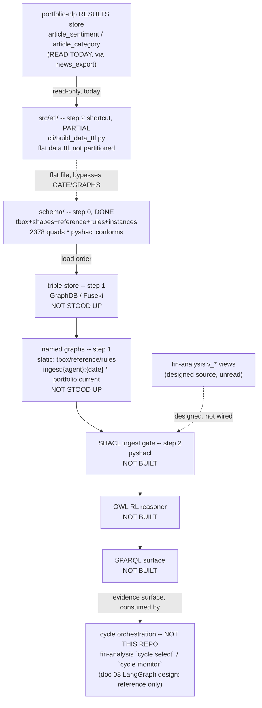

# SPEC.md — `portfolio-knowledge-graph`

Part of the thesis *"Sistema inteligente para la optimización de la inversión
en portafolios mediante integración de información financiera estructurada y
no estructurada de acciones del S&P500"* — Gabriel Jaime Múnera González &
Dovaribi Carupia Yagari, Universidad Pontificia Bolivariana (UPB). Referred
to elsewhere in this document and the architecture artifacts by its working
nickname, "Portfolio Thesis."

The technical contract for this repository: requirements, architecture, data
model, and acceptance criteria. Where `.specify/memory/constitution.md` is
the philosophy/principles/code-style layer this repo commits to regardless of
feature, this document is the "what, precisely" layer for the system it
implements — every requirement below should be traceable to a test, and every
design decision should be explainable by a principle in the constitution.
Link liberally: a design choice justified by, e.g., the constitution's
Architecture or Security & Data principles is annotated `(constitution: …)`
below rather than re-argued here.

Requirement IDs (`FR-0xx` functional, `NR-0xx` non-functional) are stable —
don't renumber an existing one, even if it's later superseded; mark it
superseded in place instead. Reference them in commits/PRs/tests
(`test_two_tier.py::test_source_readonly  # FR-007`) so a reviewer can trace
implementation back to requirement and requirement back to test.

---

## 1. Overview & Purpose

`portfolio-knowledge-graph` is the semantic layer of a six-repository system
(the "Portfolio Thesis") that builds and maintains an S&P 500 portfolio on
top of a knowledge graph. Data flows in one direction through the system:

```
sources (Wikipedia/news/Finnhub/SEC EDGAR)
  → portfolio-data-mining      (acquisition: discovers URLs, extracts article text)
  → portfolio-nlp              (semantic layer: sentiment/NER/category/summaries)
  → portfolio-financial-analysis (fundamentals/pricing/cycle/quant → SEMANTIC score input)
  → portfolio-knowledge-graph   (THIS REPO — RDF/OWL projection + SPARQL evidence surface)
  → portfolio-reports          (as-of run engine, per-name evidence, HTML report)
  → portfolio-app                (thin Streamlit client)
```

with one feedback edge running back up (a user-defined decision criterion,
compiled once in `reports` and propagated into `financial-analysis` and the
knowledge graph) — out of scope for this repo, noted here only for context.

**What this repo is for**: a portfolio decision needs one auditable place
that ties every signal — universe membership, fundamentals, sentiment, risk
events, veto outcomes, portfolio history — back to *why* it's true and *when*
it became true. `portfolio-knowledge-graph` defines and hosts the formal
RDF/OWL/SHACL ontology (`schema/`) every other repo's data is meant to be
projected into (roadmap step 0, done), the named-graph topology and reasoning
profile that makes that projection queryable and bitemporal
(`07-ontology-topology.md`, designed), and — as a first, narrower cut ahead of
the full projection (roadmap step 2, partially begun) — an ETL
(`src/etl/`) that turns `portfolio-data-mining`'s point-in-time `universe.db` plus
`portfolio-nlp`'s already-published sentiment/category results into a
single-shot, flat `data.ttl` load, so that the ontology has *some* real data
to validate against before the target architecture (a standing triple store,
a SHACL ingest gate, an OWL RL reasoner, a SPARQL surface) is built out.

**Scope principle (maintainer decision, recorded 2026-10-02 from the T-007
upstream-repo scan)**: this repo is **purely integrative**. It defines the
ontology, projects its siblings' already-computed outputs into it,
SHACL-validates what goes in, and exposes the result for query. All
computation — acquisition, NLP, fundamentals, pricing, scoring, vetoes,
ranking, portfolio construction, entity resolution, the Markowitz benchmark —
is done by `portfolio-data-mining`, `portfolio-nlp` and
`portfolio-financial-analysis`; if a capability needs a model, a formula or a
scheduler, it belongs in one of those, not here. §2.5 is the ownership map.

**Transitional exception**: `src/etl/` (§2.1, FR-004–FR-006) is a temporary
compatibility path. Its existing computations — per-article Sentiment
`ScoreSnapshot`s and the severity-derived, gated `:RiskEvent`s — remain
allowed, and are not a violation of the principle above, until the Work item 4
projection replaces it. The Sentiment snapshots are then replaced by the
projected upstream SEMANTIC row; no upstream view corresponds to `:RiskEvent`
(none appears in the §2.5 view list), so its replacement or retirement is an
open decision for Work item 4, not something this exception settles.

**What this repo is explicitly not**: it does not compute fundamentals,
pricing, cycle rankings, or quant scores (`portfolio-financial-analysis`'s
job); it does not run any NLP model or own article source text — it reads
only `portfolio-nlp`'s already-published RESULTS rows, read-only, never
`portfolio-nlp`'s SOURCE text or its own model inference; it does not (yet)
stand up a triple store, a SHACL ingest gate, an OWL reasoner, a SPARQL
surface, or the two LangGraph agent cycles that are meant to read all of the
above (`08-agent-architecture.md`, designed but unbuilt — roadmap steps 1 and
3–8); it makes no portfolio or trading decision and renders no report
(`portfolio-reports`/`portfolio-app`'s job).

## 2. Scope & Requirements

### 2.1 In scope

- The formal ontology bundle in `schema/`: `tbox.ttl` (40 classes — 27
  mutually-disjoint leaves under a 13-class `rdfs:subClassOf` backbone),
  `shapes.ttl` (20 SHACL node shapes), `reference.ttl` (GICS taxonomy + 5
  worked-example assets + the `MetricType` vocabulary), `rules.ttl` (a
  6 active upstream veto rules as single-leaf `RuleDefinition`s, the 7 original tree rules kept
  closed with `validTo`, + `AttractivenessWeightScheme`),
  `instances.trig` (a 15-named-graph worked-example ABox) — roadmap step 0,
  done and verified (**2378 quads, `pyshacl conforms: True**).
- The five numbered architecture/spec docs (`06`–`10`) plus
  `critique-and-evolution.md` as the traceability anchor every class/
  property/graph-placement decision elsewhere cites back to.
- The step-2 ETL (`src/etl/`, entry `cli/build_data_ttl.py`):
  `portfolio-data-mining`'s `universe.db` → `:Asset`/`:classifiedAs` (every
  symbol ever in the index, minus tickers `reference.ttl` already declares) and
  one `:UniverseMembership` per membership stint + `portfolio-nlp`'s
  RESULTS store (via `portfolio_common.news_export`, read-only) →
  `:NewsArticle` / `:ScoreSnapshot` (Sentiment) / `:RiskEvent` (gated) — a
  single-shot flat `data.ttl`, not the named-graph-partitioned target
  architecture.
- Keeping the schema and its companion docs internally consistent: the exact
  class/shape/graph/quad counts asserted in `06`/`07` and `schema/README.md`
  must stay in sync with `tbox.ttl`/`shapes.ttl`/`instances.trig` after any
  edit — validated by the parse-and-conform check below.

### 2.2 Out of scope

- Standing up a triple store (GraphDB/Fuseki) — roadmap step 1.
- The SHACL ingest gate, dated named-graph partitioning
  (`ingest:{agent}:{date}`), OWL RL reasoning, and the SPARQL query surface —
  designed in `07`/`08`, not built (roadmap steps within 1–2 and beyond).
- Computing fundamentals, pricing, cycle rankings, or quant scores
  (`portfolio-financial-analysis`).
- Running any NLP model, discovering/crawling article URLs, or re-deriving
  from source data anything the processed stores already publish
  (`portfolio-nlp`'s RESULTS, `portfolio-financial-analysis`'s `v_*` views):
  this repo reads those outputs where they exist (FR-005). Reading SOURCE
  itself is allowed, read-only. Today the transitional ETL reads `articles`
  through the shared join and scans `body_text` for its provisional G3
  hard-trigger keyword bump, which no processed store publishes (§13 item 12).
- The two LangGraph agent cycles (`SelectionCycleGraph` quarterly,
  `MonitoringCycleGraph` daily) and any scheduler — the two-speed cycle is
  already implemented upstream as `portfolio-financial-analysis`'s `cycle`
  package (`cycle select` / `cycle monitor`, checkpointed, T-1 contagion-
  lagged); this repo builds no orchestrator. No scheduler exists upstream
  either (its own §14 puts one out of scope); the maintainer has assigned
  triggering the quarterly/daily cycles to the future `portfolio-app`
  (§2.6 D9, PLAN Work item 7).
- The SEMANTIC per-`(asset, day)` aggregation — owned by `portfolio-nlp`,
  materialized as `score_snapshot[SEMANTIC]` by `portfolio-financial-analysis`;
  this repo only projects the resulting row (§2.5, PLAN Work item 5).
- Entity resolution (`sharedExecutiveWith`), portfolio construction, sector
  scoring and the Markowitz benchmark (roadmap steps 7–8) — built upstream in
  `portfolio-financial-analysis` (`entity_resolution`, `cycle`, `quant`);
  here they exist only as projected `v_*` rows.
- SEC EDGAR filings/sections, pricing/trading data, `:Executive` individuals,
  `article_summary`/`sector_summary` ingestion, and entity extraction beyond
  sentiment/category — all explicitly excluded from the current ETL phase
  (`src/etl/README.md`'s scope table).
- Backtesting (roadmap step 9) and any UI (`portfolio-app`) or report
  rendering (`portfolio-reports`).

### 2.3 Functional requirements

| ID | Requirement | Acceptance criteria |
|---|---|---|
| **FR-001** | The `tbox.ttl`/`shapes.ttl`/`reference.ttl`/`rules.ttl`/`instances.trig` bundle parses as a single `rdflib.Dataset` in the documented load order and `pyshacl`-conforms against `shapes.ttl`. | The `schema/README.md` parse script reports `quads: 2378`; a `pyshacl.validate` run over the same combined graph reports `conforms: True` — both required after any schema edit. |
| **FR-002** | Every domain class in `tbox.ttl` that is not a shared-property superclass (`ObservationSnapshot`/`EvidenceSource`/`RuleOperand`) belongs to exactly one `AllDisjointClasses` set and reaches at least one of the 6 taxonomy roots via `rdfs:subClassOf`. | `tbox.ttl`'s `AllDisjointClasses` block lists exactly 25 leaf classes; a taxonomy audit (cycle/orphan/multi-parent detection over the `subClassOf` graph) reports 0 cycles, 0 self-loops, all 38 classes reaching a root, exactly 3 legitimately multi-parented classes (`schema/README.md`'s implementation addendum). |
| **FR-003** | Every `RuleDefinition` in `rules.ttl` expresses its veto condition as an explicit `RuleClause` tree (`AND`/`OR` of `ThresholdComparison`/`CategoricalComparison`/`GraphPredicate` leaves), never as an infix boolean string. | No `RuleDefinition` in `rules.ttl` carries a rule condition as a literal string to be re-parsed; every `hasClause` path terminates in one of the three documented leaf operand kinds. A single leaf (upstream's six rules, T-103) is a valid tree. |
| **FR-004** | `cli/build_data_ttl.py` projects `portfolio-data-mining`'s point-in-time `universe.db` (`SQL_UNIVERSE_DB`, read-only through `portfolio_common.db`) into one `:UniverseMembership` per `universe_membership` stint (`validFrom` = `valid_from`; `validTo` = `valid_to`, exclusive, absent while the stint is open) in the single `:SP500Index` `:Universe`, and one `:Asset` per symbol with `:classifiedAs` when upstream has a sub-industry. A symbol whose stints are all closed has only `tickerSymbol` and `companyName`: upstream has no CIK or sector for it, and none is invented (`AssetShape` allows a missing `cikNumber` only then). Tickers `reference.ttl` already declares as `:Asset` get memberships but are not re-emitted (so `cikNumber` never collides under the functional-property `sh:maxCount 1` contract). Each run prints `universe.db`'s latest recorded change and its file modification date, because upstream refreshes it by hand. | A full run's `:Asset` count plus `reference.ttl`'s tickers equals `universe.db`'s distinct symbols; its `:UniverseMembership` count equals `universe_membership`'s rows; none of `reference.ttl`'s tickers appears as a second `:Asset` declaration in `data.ttl`; the run summary prints the freshness line. |
| **FR-005** | `cli/build_data_ttl.py` projects the shared join of SOURCE `articles` with `portfolio-nlp`'s RESULTS `article_sentiment`/`article_category` (`fetch_status = 'ok'`) into `:NewsArticle` + `:ScoreSnapshot` (`agentOrigin = SEMANTIC`, `metricType = Sentiment`) + a gated `:RiskEvent`, via `portfolio_common.news_export`'s read-only connect — never a raw `sqlite3` connection. Reading SOURCE (`urls.db`, `body_text` included) is allowed. What is forbidden is reading a source or raw database for something the processed stores already publish (`portfolio-nlp`'s RESULTS, `portfolio-financial-analysis`'s `financial.db` / `v_*` views), or re-deriving it there: sentiment, category, entities, fundamentals, prices, scores. Those are read from the processed store. A SOURCE-derived signal with no processed equivalent is allowed if it is flagged provisional (constitution §7); today that is only G3's hard-trigger keyword bump (§13 item 12) | `grep -rn "import sqlite3" src/etl` returns nothing; every value `src/etl/` derives from a SOURCE column other than identity and metadata (`id`, `ticker`, `pub_date`, `fetched_at`, `fetch_status`) is a row in `src/etl/README.md`'s provisional-formulas table, which says why no processed store publishes it; every `:NewsArticle` emitted in a sample run traces to a source row with `fetch_status = 'ok'`. |
| **FR-006** | The post-build validation step SHACL-checks either the full output (`--limit` given) or a fresh `KG_SAMPLE_NEWS_ROWS`-row sample against the real `tbox.ttl` + `shapes.ttl` + `reference.ttl` — never a full `pyshacl` pass over the unsampled, multi-million-triple `data.ttl`. | `uv run cli/build_data_ttl.py --limit 500` prints `SHACL conforms: <bool>`; an unsampled default run builds and discards a `KG_SAMPLE_NEWS_ROWS`-row sample file rather than validating `data.ttl` directly. |

### 2.4 Non-functional requirements

| ID | Requirement | Acceptance criteria |
|---|---|---|
| **NR-001** | The ontology's and its companion docs' asserted counts (class/shape/graph/quad totals) stay in sync after any schema edit. | `schema/README.md`'s stated counts match a fresh run of the FR-001 parse+`pyshacl` check; a PR changing `tbox.ttl`/`shapes.ttl`/`instances.trig` without updating the doc's numbers is incomplete. |
| **NR-002** | A database-engine change (away from SQLite, or a `portfolio-common` results-contract bump) must not require touching this repo's ETL logic beyond a version/tag bump. | `grep -rn "import sqlite3" src` returns nothing; the only engine-specific access goes through `portfolio_common.db`/`portfolio_common.news_export`. |
| **NR-003** | Raw OHLCV/tick-level price data never enters the ontology or the ETL output (`07-ontology-topology.md`'s explicit warning). | `tbox.ttl` defines no tick-level price class; `grep` for a raw-bar/tick field name in `schema/` or `src/etl/` returns nothing beyond the bounded `PriceObservation` summary class. |
| **NR-004** | The IRI namespace stays `https://thesis.local/kg/portfolio#` for every new term across `schema/*.ttl`/`.trig` unless deliberately aligning to an external vocabulary. | A bare `owl:Class`/`owl:ObjectProperty`/`owl:DatatypeProperty` declaration outside that namespace, excluding the documented FIBO `rdfs:seeAlso` and GICS `skos:Concept` alignments, does not occur. |
| **NR-005** | The only automated gate is the `rdflib` parse + `pyshacl` conformance check (FR-001) — there is no `pytest` suite and no CI workflow configured today. | The parse+`pyshacl` script passes locally before merge; this NR exists so the absence of a test suite/CI is a documented decision (§14), not an oversight a reader might mistake for one. |

### 2.5 Scope boundary — what this repo owns vs. consumes

Established by the T-007 scan (2026-10-02) of `portfolio-data-mining`,
`portfolio-nlp` and `portfolio-financial-analysis` (READMEs + their own
`SPEC.md`s; read, not executed).

| Repo | Computes / owns | Surface this repo may consume | Consumed today? |
|---|---|---|---|
| `portfolio-data-mining` | News URL discovery and article text extraction (`news_collector`, `extractor` → `urls.db`); Finnhub/yfinance pricing HTTP service (`pricing`: `GET /pricing/{ticker}`, `/pricing/{ticker}/actions`, `/universe`); SEC EDGAR HTTP service (`sec_edgar`); the S&P 500 universe, live (`data_mining.portfolio`) and **point-in-time** (`data_mining.universe_history` → `universe.db`, SCD-2 `universe_membership`) | `universe.db` — the point-in-time membership every upstream agent already reads read-only (D1); its HTTP services and `urls.db` are consumed by the other two repos; `src/etl/` also reads `urls.db` through `news_export` (FR-005, §13 item 12) | Yes — `universe.db` by `src/etl/` (FR-004, T-100); `urls.db` transitionally via `news_export` (FR-005); the HTTP services stay indirect (§12) |
| `portfolio-nlp` | Sentiment (FinBERT), NER, category, summaries → `nlp.db` (`article_sentiment`/`article_entities`/`article_category`/`article_summary`/`sector_summary`); proposed owner of the per-`(asset, day)` SEMANTIC aggregation (not built) | `nlp.db` RESULTS, read-only | Yes — `src/etl/` via `portfolio_common.news_export` |
| `portfolio-financial-analysis` | `fundamental_agent` (EDGAR ratios + LLM assessment, Ring-1 `DQ_*` data-quality gates), `pricing_agent`, `cycle` (a checkpointed topological runner — Strands-era, not LangGraph: TECHNICAL/VALORIZATION/SECTOR scores, veto stints, ranking, positions, `backfill` replay), `entity_resolution` (news-co-occurrence *candidates*, projected as `AssetCoOccurrence`, T-107), `quant` (Markowitz benchmark books, forward evaluation; finished view-exposed numbers projected as benchmark `Portfolio`s and `BenchmarkObservation`s, T-108), read-only HTTP `api/` (:8010); passive `kg_schema` (DDL, migrations, `schema_version`, views) | The 31 `v_*` read-contract views over `SQL_FINANCIAL_DB` (SQLite, `mode=ro`): `v_score_snapshot`, `v_sector`, `v_industry`, `v_sector_aggregate_snapshot`, `v_price_observation`, `v_corporate_action`, `v_quant_return_daily`, `v_risk_free_rate`, `v_benchmark_series`, `v_sec_filing`, `v_sec_filing_section`, `v_veto`, `v_rule_catalog`, `v_data_quality_issue`, `v_portfolio_position`, `v_shared_executive_edge`, `v_cycle_ranking`, `v_weight_scheme`, `v_weight_component`, `v_quant_risk_model`, `v_quant_portfolio`, `v_quant_position`, `v_quant_frontier_point`, `v_quant_benchmark_performance`, `v_quant_vs_live`, run logs `v_analysis_run`/`v_pricing_run`/`v_quant_run`/`v_cycle_run`, `v_universe_coverage`, and `v_universe_membership` (**frozen** — use `universe.db`). No view exposes `fundamental_metrics`, `financial_facts` or `filing_cover_shares` | No — designed source, unread (§13 item 2) |
| `portfolio-knowledge-graph` (this repo) | The ontology (`schema/`); the projection of the above into SHACL-validated, dated named graphs; the store, reasoner and SPARQL surface over them | — | — |

Consequences for this repo's scope:

1. **No computation here.** Anything that would compute a score, rank, veto,
   position, sentiment or filing metric is out of scope; this repo
   *represents* it (`:ScoreSnapshot`, `:Veto`, `:PortfolioPosition`, …) with
   provenance back to the upstream `run_id`/`as_of`/`code_version`.
2. **Read upstream through its published contract only** — `nlp.db` RESULTS
   via `portfolio_common.news_export`, and `financial-analysis`'s `v_*` views
   opened read-only (`mode=ro`). Never read an upstream's SOURCE or raw
   tables for something its processed stores already publish, and never
   through a raw connection (NR-002 spirit). SOURCE `urls.db` through
   `news_export` is allowed for a signal no processed store has, flagged
   provisional (FR-005; today only G3's keyword bump, §13 item 12); the
   transitional exception in §1 covers it until Work item 4. `universe.db`
   is a direct, read-only upstream contract (FR-004, §2.6 D1).
3. **The pricing endpoint exists** (`portfolio-data-mining`
   `apps/pricing_api.py`, `GET /pricing/{ticker}`; consumed by
   `portfolio-financial-analysis`'s `pricing_agent`). The roadmap's earlier
   "`src/trading/` is empty / no pricing pipeline anywhere" claim is stale.
   This repo needs no pricing access: only `v_price_observation` summaries
   (NR-003).
4. **`financial-analysis`'s `kg_schema` mirrors much of this ontology's
   vocabulary** (`ScoreSnapshot`, `UniverseMembership`, `PriceObservation`,
   `SECFilingSection`, `Veto`, `PortfolioPosition`, `sharedExecutiveWith`,
   sector aggregates, weight schemes) — but the **semantics differ in
   places that matter** (§2.6: temporal model, veto lifecycle, rule catalog,
   score-type names, edge evidence). It is not a 1:1 mapping job; each
   difference needs a decision before the projection is written (PLAN Work
   item 11).
5. **There is no scheduler in any existing repo.** `financial-analysis`'s own
   §14 makes a scheduler and a cross-module orchestrator out of scope there
   (its Work item 2, an orchestrator, is open). Delegating the cycle upstream
   delegates the *logic* (`cycle select`/`monitor`); the maintainer has
   assigned *triggering* it to `portfolio-app` (not yet created), so the
   cadence is manual until that repo exists.

### 2.6 Upstream drift register (T-007 rescan, 2026-10-02)

The first T-007 pass mapped *who owns what*. This second pass compared
`portfolio-financial-analysis` (and, where it bites, `portfolio-nlp`/
`portfolio-data-mining`) against **this repo's** SPEC, ontology and ETL, to
catch capabilities and semantics that moved on after the ontology was
designed. Sources: those repos' `.specify/memory/SPEC.md`, `docs/*.md`,
`src/kg_schema/{views,ddl,migrations}.py`, `src/cycle/rules/builtin.py`
(read in a shallow clone; **nothing was executed**, so every row is a
documentation/code-reading claim, not a runtime-verified one). Each row
names the decision it forces; the decisions were PLAN Work item 11's backlog
and their dispositions are in the table after the register (T-112).

| # | Upstream fact | This repo today | Why it matters / decision forced |
|---|---|---|---|
| D1 | **Point-in-time S&P 500 universe.** `portfolio-data-mining` keeps `universe.db` (SCD-2 `universe_membership`: `symbol, security, gics_sector, gics_sub_industry, hq_location, date_added, cik, founded, valid_from, valid_to, source`), reconstructed from Wikipedia's "Historical components" change log (`source` = `wikipedia_changes_backfill` \| `live_snapshot`) and refreshed only by manual `universe-backfill`/`universe-snapshot`. Every upstream agent takes `--analysis-date D` and reads membership with `valid_from <= D AND (valid_to IS NULL OR valid_to > D)`, deduped by symbol keeping the latest stint; `financial-analysis`'s own `universe_membership` table and `v_universe_membership` are **frozen**. | FR-004 builds `:Asset`s from Wikipedia's *live* constituent table at ETL run time; no `:UniverseMembership` individual is produced; §12 declared no dependency on `portfolio-data-mining`. `UniverseMembership` (with `validFrom`/`validTo`) already exists in `tbox.ttl`. | The ontology's bitemporal universe has a real source; the ETL ignores it and so cannot represent who was in the index on any past date (survivorship bias). `universe.db` is therefore a **direct upstream contract** (read-only), and a stale `universe.db` between manual snapshots is a known upstream risk. **Decision (maintainer, 2026-10-05): adopt.** The live-scrape asset master is retired in favour of `universe.db` (T-100): every stint becomes a `:UniverseMembership`, every symbol an `:Asset`, and as-of reads are queries over `validFrom`/`validTo` in the graph. Chosen with it: `cikNumber` is optional only for an `:Asset` whose memberships are all closed (no CIK is invented); upstream's `valid_from` is kept as is (`1976-07-01` means "before upstream's records begin"); a news ticker `universe.db` lacks (`EQR`) stays unresolved and is raised upstream; each run prints `universe.db`'s freshness. |
| D2 | **Two-clock model with look-ahead guard.** Rows carry `event_time` (what the row is about) and `available_at` (when usable: first NYSE trading day *after* the filing date, T-107) alongside `computed_at`/`ingested_at`; every as-of reader filters on `available_at`, never `event_time`; `v_score_snapshot.event_time` = filing period-end (FUNDAMENTAL), cycle date (TECHNICAL/VALORIZATION), article-day (SEMANTIC). | `ScoreSnapshot` has `timestamp`/`detectedAt`/`provenanceId`; bitemporality is expressed only by dated named graphs (`07`). No `availableAt`/`eventTime` property. | A projection that stamps FUNDAMENTAL scores by filing date or period-end would leak look-ahead into every "as of D" query. **Decided and implemented (T-101, 2026-10-03):** `availableAt` (required) and `eventTime` (optional) are `ScoreSnapshot` properties; `timestamp` is unchanged. |
| D3 | **Veto stints, not events.** `veto` rows are stints (`raised_on`, `cleared_on`, `last_seen_on` = cycle dates; `detected_at`/`cleared_at` wall-clock only); closed, never deleted; a HARD veto *clears* when its rule re-evaluates clean; a SOFT stint charges `soft_veto_penalty` once; active at cutoff `C` iff `raised_on <= C AND (cleared_on IS NULL OR cleared_on > C)`; the T-1 lag is this predicate applied at read time. | `Veto` has `decidedAt`/`detectedAt`; the T-1 lag was designed as a LangGraph checkpointer mechanism (`08`). | Needs `raisedOn`/`clearedOn`/`lastSeenOn` (or `validFrom`/`validTo`) on `:Veto`, and the T-1 predicate as a SPARQL pattern, not an orchestrator feature (T-102). **Implemented (T-102, 2026-10-03):** `:Veto` carries `raisedOn` (required), `clearedOn`, `lastSeenOn` (multi-valued, current = MAX) and per-stint `vetoSeverity`; `VetoShape` enforces date order; the active-at-cutoff SPARQL is in `schema/README.md`. Upstream `cleared_at` is dropped. |
| D4 | **Different rule catalog.** Six flat threshold rules in `cycle/rules/builtin.py`: `LEVERAGE_EXTREME` (D/E > 3, HARD), `NEGATIVE_FCF` (HARD), `LIQUIDITY_DISTRESS` (current ratio < 1, SOFT), `PRICE_CRASH` (90d drawdown < −35%, SOFT), `EARNINGS_MISSING` (FUNDAMENTAL score aged > 400d, SOFT), `DATA_QUALITY` (a HARD Ring-1 gate fired, HARD); plus a non-veto `UNSCORED` exclusion in `rank` (T-119). No AND/OR tree (their §13 item 6 accepts that) and **no contagion/`sharedExecutiveWith` rule**. | `rules.ttl` holds 7 `RuleClause`-tree rules (`VETO_FIN_01`, `VETO_LEG_01`, `VETO_COMP_01..03`, `VETO_MKT_02`, `VETO_RED_01`) — different ids, different logic. | `v_veto.rule_id` values (`LEVERAGE_EXTREME`, …) resolve to no `:RuleDefinition`, so a projected `:Veto` would violate `:appliesRule` conformance. Our catalog is a design; upstream's is what actually runs. Decide: add the six as (flat-leaf) `RuleDefinition`s and mark ours as design-only, or reconcile the other way (T-103). **Disposition (maintainer, 2026-10-02): upstream's catalog is final and authoritative** — `portfolio-financial-analysis`'s six rules are preserved as implemented; `rules.ttl`'s seven tree rules are superseded (design history, not a target). **Implemented (T-103, 2026-10-03):** `rules.ttl` carries the six as `RuleDefinition`s whose `hasClause` is a single leaf (`ThresholdComparison`, or a `GraphPredicate` for `DATA_QUALITY`); added `:ruleSeverity` (HARD/SOFT) and the upstream metric ids to `ThresholdComparisonShape`. The seven tree rules are closed with `validTo 2026-10-02` and kept as design history (the worked example in `instances.trig` still resolves them); `VETO_RED_01`'s contagion rule has no upstream counterpart and is dropped from the target. `priorityRank` follows upstream's list order (upstream has none); branch logic that does not fit one leaf (LEVERAGE_EXTREME's negative-equity guard) stays upstream and is described in `rdfs:comment`. |
| D5 | **Data-quality gate.** Ring-1 `DQ_*` gates (`dq-v2`) write `data_quality_issue` (`severity`, `quarantined`, gated value); a quarantined metric reads as NULL; HARD → the `DATA_QUALITY` veto. Exposed as `v_data_quality_issue`. | No class or property for it. | Either model `:DataQualityIssue` (evidence for the `DATA_QUALITY` veto) or consciously drop it; at minimum a `DATA_QUALITY` veto needs an evidence target (T-104). **Implemented (T-104, 2026-10-03):** modelled as `:DataQualityIssue`, an `EvidenceSource` leaf (`dqGateCode`, `dqSeverity`, `quarantined`, `gatedValue`, `dqIssueOfAsset`, plus `dqRaisedOn` (required) and optional `dqIssueOfFiling`/`dqMetricName`/`provenanceId`) with `DataQualityIssueShape`. |
| D6 | **Score-type vocabulary.** `score_type` ∈ {FUNDAMENTAL, VALORIZATION, TECHNICAL, SEMANTIC, SECTOR}; `QUANTITATIVE` was **renamed `VALORIZATION`** by migration m006 (and `SECTOR` = SectorRelativeMomentum, not in the blend). Extra provenance: `forensic_flags_json`, `prompt_hash` (FUNDAMENTAL), `correction_rule` (`financial_facts`). | `shapes.ttl` `agentOrigin` was `sh:in ("FUNDAMENTAL" "SEMANTIC" "QUANTITATIVE" "TECHNICAL" "SECTOR")`; `MetricType` vocabulary has `ScoreCuantitativo`. | (Implemented, T-105: `agentOrigin` is now `VALORIZATION`; `ScoreCuantitativo` metric id kept; decided in T-109: upstream has no metric id for a score beyond `score_type`, which is `agentOrigin`, so no rename.) |
| D7 | **Provenance and versioning.** Every row carries `run_id`; run logs (`v_analysis_run`/`v_pricing_run`/`v_quant_run`/`v_cycle_run`) record `as_of`, `code_version` (git SHA, `-dirty` refused unless `--allow-dirty` with a recorded reason), params; `engine_version` (parallel rows; `v_*` views pick the newest per key), metric-version manifests, a monotonic `schema_version` floor. | One opaque `provenanceId` per individual. | The audit trail the ontology promises ("why is this true and when") has a concrete upstream shape that `provenanceId` can't carry. **Implemented, T-106:** optional `runId`/`runAsOf`/`codeVersion`/`engineVersion`, no `rdfs:domain`, allowed by SHACL on `ScoreSnapshot`, `SectorAggregateSnapshot`, `Veto`, `PortfolioPosition`, `DataQualityIssue`, `AssetCoOccurrence`, `BenchmarkObservation` (on `Veto`/`PortfolioPosition` they record only the run that opened the record; no `Run` class; run log stays upstream; ETL projectors do not yet emit them); `forensic_flags_json`/`prompt_hash`/`correction_rule` not projected. `run_id` is an integer upstream, numbered separately per run table, so `runId` stays `xsd:string` and is written `<run table>:<id>` (T-109). The `schema_version` floor is 9 (T-109); asserting it waits for a projector. |
| D8 | **Replay and cycle types.** `cycle_type` ∈ {SELECTION, MONITORING, ENTITY_RESOLUTION, REPLAY}; `cycle backfill` writes a simulated book to `portfolio_position_replay` (never in `v_portfolio_position`) but its scores/vetoes/rankings land in the **shared** tables, indistinguishable from live ones (upstream's own caveat), against a throwaway DB. `v_cycle_ranking`'s docstring says "latest cycle per cycle_type" but its SQL returns every `cycle_run`'s rows — docstring and code disagree. | `ORCHESTRATOR` lane assumed one dated graph per cycle (`07`/`instances.trig`). | Project only against a production DB. **Confirmed, T-109:** `v_cycle_ranking`'s SQL returns every run (docstring wrong), so filter by `cycle_run_id`/`cycle_date`, and exclude `cycle_type='REPLAY'` rows (the view exposes `cycle_type`). |
| D9 | **No scheduler, not LangGraph.** `cycle` is a checkpointed topological runner (`cycle_run`/`cycle_checkpoint`, relational — "not the framework, is the source of truth for resume"; Strands can drive it later). A scheduler and a cross-module orchestrator are explicitly out of scope upstream (their §13 item 3, §14). Run order (`pricing → fundamental → entity_resolution → cycle → quant`) is manual. | `08-agent-architecture.md` designs two LangGraph graphs; this SPEC (first T-007 pass) implied the scheduler was delegated. | Corrects the first pass: the quarterly/daily cadence is owned by nobody (T-108). `08` must be reconciled (T-008). **Disposition (maintainer, 2026-10-02): cycle triggering is orchestrated by `portfolio-app`** (not yet created), which calls the upstream endpoints as it needs. Not this repo, not a scheduler upstream. Open: upstream's `api/` is read-only and its agents are CLI-driven with no run-trigger endpoint, and upstream's docs name `portfolio-reports` (not `portfolio-app`) as the repo that triggers runs — to be raised with those repos (T-120, Work item 12). |
| D10 | **Entity edges are candidates, news-derived.** `entity_resolution` emits `shared_executive_edge` from PER-span co-occurrence in news (`method = news-per-cooccurrence-v1`, `weight`, mean NER score in `evidence_json`), recomputed per method (`DELETE … WHERE method`, then insert); `v_shared_executive_edge` is a pair-level aggregate; a separate `media_cooccurrence` table (T-043, populated once their T-082 lands) holds non-executive co-occurrence. Their docs: "News co-occurrence ≠ an actual shared directorship." | `:sharedExecutiveWith` is designed over `:Executive`s from DEF 14A and is the structural input to `VETO_RED_01`. | Projecting a candidate edge as `:sharedExecutiveWith` would assert weak, method-dependent evidence as fact. Needs a method/weight/confidence on the edge or a separate candidate property. **Implemented, T-107**: separate reified `:AssetCoOccurrence` (kind, method, weight, computedOn, exactly two assets); `:sharedExecutiveWith` reserved for verified edges; `media_cooccurrence` is deferred (kind `MEDIA` not enumerated until upstream exposes a `v_*` view for it; none exists, T-109). ETL projector not built yet. |
| D11 | **A whole quant domain.** `corporate_action`, `quant_return_daily`, `risk_free_rate`, `benchmark_series`, `quant_risk_model` (μ/Σ stay internal), `quant_portfolio`/`quant_position`/`quant_frontier_point`, `quant_benchmark_performance`, `v_quant_vs_live` (active weight vs the live book). Upstream's own critical gap: μ carries no cross-sectional signal, so the return-aware objectives are not defensible (their §13 item 1). | Only `Portfolio`/`PortfolioPosition`; NR-003 keeps raw price/tick data out. | Decide which of it is in the graph at all — plausibly benchmark books and their positions/performance as `:Portfolio` individuals of a benchmark kind; never the return series, μ or Σ (T-108). **Disposition (maintainer, 2026-10-03; implemented, T-108): only finished numbers upstream already computes and exposes through a `v_*` view become individuals** -- benchmark books (`Portfolio`, `portfolioKind` BENCHMARK), their `PortfolioPosition`s and `BenchmarkObservation`s (performance metrics; per-asset active weight from `v_quant_vs_live`). Nothing is computed here. Not read: return series, μ, Σ, `risk_free_rate`, `corporate_action`, `benchmark_series`, `quant_frontier_point`. View columns pinned in T-109. **`live_book` (T-109 review, option B):** `v_quant_portfolio` also holds `kind='live_book'`, upstream's snapshot of the live book used to measure its return; it is **not** projected as a `Portfolio` (that would duplicate the live holdings under a BENCHMARK label) and its performance numbers attach to the LIVE `Portfolio`, so `quantPortfolio` accepts LIVE or BENCHMARK (`QuantSubjectShape`; a LIVE subject carries only `realized_return`/`cumulative_return`/`benchmark_return`/`active_return`). |
| D12 | **Ratios are not in the read contract.** Rules read `fundamental_metrics` ratios (debt-to-equity, FCF margin, current ratio, drawdown), but no `v_*` view exposes `fundamental_metrics`, `financial_facts` or `filing_cover_shares` (market cap). Only the 0–100 FUNDAMENTAL score, filings/sections, vetoes (with `evidence_json`) and DQ hits are projectable. | Our rule trees compare metrics via `ThresholdComparison` over `ScoreSnapshot`s. | Re-evaluating upstream's rules in the graph is impossible from the views; vetoes arrive as upstream *outcomes* with evidence, not as recomputable rules. Outcome-only for now; confirmed T-109 that no view exposes them, and `v_score_snapshot` lacks `forensic_flags_json`/`prompt_hash`. Asking upstream for a view is part of the unsent note. |
| D13 | **Weight schemes are per run.** `v_weight_scheme` = one row per `cycle_run` that recorded a blend (scheme id + `top_n`, name/sector caps, soft-veto penalty); `v_weight_component` = one row per `(cycle_run, score_type)`; no `valid_from`/`valid_to` ("a later run with a changed blend is a new row"). Defaults FUND .4 / VALOR .3 / TECH .2 / SEM .1, renormalized over present types; upstream plans to hold SEMANTIC at 0 until `portfolio-nlp` has a labelled eval. Pending upstream WI 18 (T-134–T-139) will make the caps depend on N. | `AttractivenessWeightScheme`/`WeightComponent` (versioned weight schemes, `computedWithScheme`). | **Checked 2026-10-05 against `v_weight_scheme`/`v_weight_component`: does not map as is.** (1) Ours is a standing, versioned scheme (`validFrom`/`validTo`); upstream's is one row per `cycle_run` with no validity interval, so a snapshot's `computedWithScheme` should point at a per-run scheme individual. (2) Our components are keyed by metric name (`ScoreFinanciero`, …) plus `SectorRelativeMomentum`; upstream's by `score_type` (= `agentOrigin`), with no weight for sector momentum. (3) Our placeholder weights (.25/.20/.20/.20/.15) are not upstream's (.4/.3/.2/.1, renormalized over present types, SEMANTIC possibly 0). (4) `inverted` has no upstream counterpart. (5) The scalar knobs (`top_n`, `max_name_weight`, `max_sector_weight`, `soft_veto_penalty`) have no property here. The schema work is T-121 (Work item 12). |
| D14 | **SEMANTIC is still unbuilt on both sides, and wrongly attributed to this repo.** `portfolio-nlp` has no per-`(asset, day)` stage and no `as_of`; `financial-analysis` has no `KG_NLP_DB` reader (its `cycle` `semantic_read` step is a no-op "noting the aggregation runs in the integration repo"); its `README.md`/`docs/README.md` still name this repo as the SEMANTIC writer. Their rollout step 4 asks **this repo** to remove its SEMANTIC write path, add a `score_method` discriminator, and update docs. This repo's ETL emits Turtle only and never wrote to `SQL_FINANCIAL_DB`, so there is no write-back *code* to remove. | `src/etl/` emits per-article Sentiment `ScoreSnapshot`s (agentOrigin `SEMANTIC`). | The stale attribution is upstream docs. **Done (T-111, 2026-10-05):** optional open-vocabulary `:scoreMethod` on `ScoreSnapshot` (SHACL `maxCount 1`); every SEMANTIC snapshot carries one (the ETL's per-article rows `ARTICLE_SENTIMENT`; the worked per-`(asset, day)` rows the placeholder `ASSET_DAY_AGGREGATE` until upstream names its value). Nothing to remove in code. The wording fix upstream asks for is in their docs, not ours. |
| D15 | **Two access paths, one sufficient.** SQLite views over `SQL_FINANCIAL_DB` (opened `mode=ro`; a view whose base table is absent is dropped, so a partial DB has *missing views*, not errors) or the HTTP `api/` — which serves only `/runs`, `/universe`, `/universe/coverage`, `/scores`, `/portfolio/positions`, `/portfolio/ranking`. | Unread. | The API cannot feed the projection (no vetoes, filings, sections, rules, DQ, quant); read SQLite via `portfolio_common.db` (`read_only`), not raw `sqlite3` (NR-002). |
| D16 | **Contracts still moving.** Upstream open items that change view contents: cross-module orchestrator (WI 2), SEMANTIC half (WI 4), technical/valorization redesign + EBITDA + forensic flags + Carhart (WI 8), entity-resolution sanitization and `media_cooccurrence` routing (WI 9), N-driven weight caps (WI 18), full-universe production run (WI 12). Also: `portfolio-common` is pinned `v1.2.1` in both `financial-analysis` and `data-mining` but `v1.2.0` here and in `portfolio-nlp` (at the time of the rescan; this repo moved to `v1.2.1` in T-110). | Pinned `v1.2.0` at the rescan. | Treat the views as a versioned contract: assert `schema_version` >= 9 (T-109); re-pinned to `v1.2.1` (T-110, additive diff). |

**Dispositions (T-112, 2026-10-05).** Each row has a main label: **adopted** (upstream's
model taken as is), **translated** (kept in this ontology's own form, mapped on
projection), **rejected** (deliberately not projected), **raised upstream**
(needs an answer or a change in another repo; none has been answered yet).
**Proposed** means no decision is recorded yet. A row adds a second (or
third) label for a part it leaves open; "raised upstream" appears whenever an
open part waits on another repo.

| # | Disposition | What was done | Still open |
|---|---|---|---|
| D1 | Adopted; raised upstream | `universe.db` is the asset master and the universe's source, read-only through `portfolio_common.db` (T-100, maintainer decision 2026-10-05): one `:Asset` per symbol, one `:UniverseMembership` per stint in `:SP500Index`. `AssetShape` makes `cikNumber` optional only when every membership is closed. Each run prints `universe.db`'s latest recorded change and file date. Wikipedia is no longer read. | Upstream's: `EQR` has no row (1,104 news rows tagged `EQR` stay unresolved); `universe.db` is refreshed by hand; two symbols carry a stray `\|` (`JCP \|`, `ITT \|`; cleaned here); closed stints have no CIK, sector or sub-industry. Ours: nine symbols (`BMS`, `CEG`, `DELL`, `DOW`, `JBL`, `MXIM`, `PCG`, `Q`, `SNDK`) carry different company names across stints (some renames, some different companies) and are one `:Asset` each, described by the latest stint. |
| D2 | Adopted | `availableAt` (required) / `eventTime` on `ScoreSnapshot` (T-101). | — |
| D3 | Adopted | Veto stints `raisedOn`/`clearedOn`/`lastSeenOn`, active-at-cutoff SPARQL (T-102). | — |
| D4 | Adopted | Upstream's six rules are the catalog, written as single-leaf `RuleDefinition`s; the seven tree rules closed with `validTo` (T-103). | — |
| D5 | Adopted | `:DataQualityIssue` as an `EvidenceSource` leaf (T-104). | — |
| D6 | Adopted | `agentOrigin` `VALORIZATION` (T-105); metric id `ScoreCuantitativo` kept (no upstream id exists, T-109). | — |
| D7 | Translated; extras rejected | Optional `runId`/`runAsOf`/`codeVersion`/`engineVersion`, no `Run` class (T-106); `forensic_flags_json`/`prompt_hash`/`correction_rule` not projected. | — |
| D8 | Translated; raised upstream | Filter `v_cycle_ranking` by `cycle_run_id`/`cycle_date`, exclude `REPLAY`, production DB only (T-109). | Docstring/SQL mismatch and a replay flag, raised upstream. |
| D9 | Adopted; raised upstream | No scheduler here; `portfolio-app` triggers the cycles (maintainer, 2026-10-02). | Run-trigger endpoint and `portfolio-reports` wording, raised upstream: T-120. |
| D10 | Translated; raised upstream | Reified `:AssetCoOccurrence`; `:sharedExecutiveWith` kept for verified edges (T-107). | `MEDIA` kind waits for a `media_cooccurrence` view, raised upstream. |
| D11 | Translated; rest rejected; raised upstream | Only view-exposed finished numbers: BENCHMARK `Portfolio`s, positions, `BenchmarkObservation`s (T-108, T-109). Return series, μ, Σ, frontier points rejected (NR-003). | Confirm the `live_book` reading and the `equal_weight`/`cap_weight` names, raised upstream. |
| D12 | Rejected for now; raised upstream | Vetoes projected as outcomes with evidence; upstream's rules are not re-evaluated in the graph. | Views for `fundamental_metrics`, market cap, forensic flags, `prompt_hash`, raised upstream. |
| D13 | Translated; raised upstream | Mapping checked against `v_weight_scheme`/`v_weight_component` (T-109). | Schema work: T-121. Confirm `score_weights` contents, raised upstream. |
| D14 | Adopted; raised upstream | `:scoreMethod` discriminator; no write-back code existed to remove (T-111). | Upstream's method value (replaces `ASSET_DAY_AGGREGATE`) and its stale docs, raised upstream. |
| D15 | Adopted | Read the SQLite `v_*` views via `portfolio_common.db` read-only; the HTTP `api/` is not a source. | Implementation: Work item 4's projector. |
| D16 | Adopted; raised upstream | `schema_version` floor 9 (T-109); `portfolio-common` re-pinned to `v1.2.1` (T-110). | Assert the floor in the future projector; `portfolio-nlp` is still on `v1.2.0` (theirs to move). |

## 3. Technology Stack & Architecture Decisions

Full stack and rationale: `.specify/memory/constitution.md` §Technological
stock. Summary for traceability:

- **Runtime**: Python `>=3.12`, `uv`-managed (`uv.lock` committed,
  `package = false`).
- **Ontology tooling**: `rdflib>=7.0` + `pyshacl>=0.26` — the entire
  ontology-specific dependency surface; no triple-store client library yet
  (none is stood up).
- **ETL config**: `python-dotenv`, loading a repo-root `.env` at
  `src/etl/config.py` import.
- **Storage (ETL only)**: SQLite, two-tier SOURCE (`urls.db`)/RESULTS
  (`nlp.db`), accessed exclusively through
  `portfolio_common.news_export.connect_readonly`/`fetch_processed_articles`
  (git-tag-pinned `portfolio-common @ v1.2.1`) — no raw `sqlite3` anywhere in
  `src`/`cli` (NR-002).

Architecture decisions this repo has already made and should not be
re-litigated without a constitution amendment:

- **OWL (`tbox.ttl`) and SHACL (`shapes.ttl`) are deliberately both
  present** — OWL is open-world (what can be *inferred*), SHACL is
  closed-world (what an ingestion pipeline *rejects*). Don't collapse one
  into the other.
- **The current ETL output is a flat, non-partitioned file, a deliberate MVP
  shortcut — not the target architecture.** `07-ontology-topology.md`'s
  named-graph partitioning (`ingest:{agent}:{date}`, bitemporal audit trail)
  applies to a future, standing-triple-store load; `data.ttl` has none of
  that today (§13).
- **The `RuleClause` tree replaces v1's infix rule strings structurally, not
  just by convention** — every confluent veto rule in `rules.ttl` is
  `AND(primary_signal, OR(secondary_signals))` as an explicit tree.
- **The ETL depends on `portfolio-common` for the DB engine and the shared
  `news_export` read-only join only, never by vendoring a duplicate query
  when a shared one exists.** A local copy of `portfolio-nlp`'s
  `fetch_processed_articles` was carried temporarily (`portfolio-common`
  v1.0.0, before `news_export` existed) and has since been retired in favor
  of the shared `portfolio_common.news_export` module (`portfolio-common`
  v1.1.0+) — see `docs/portfolio-common-v1-migration-plan.md` and
  `docs/portfolio-common-v1.2-engine-agnostic.md` for the full history.

## 4. System Architecture


```mermaid
flowchart TB
    SCHEMA["schema/ -- step 0, DONE<br/>tbox+shapes+reference+rules+instances<br/>2378 quads * pyshacl conforms"]
    STORE["triple store -- step 1<br/>GraphDB / Fuseki<br/>NOT STOOD UP"]
    GRAPHS["named graphs -- step 1<br/>static: tbox/reference/rules<br/>ingest:{agent}:{date} * portfolio:current<br/>NOT STOOD UP"]
    GATE["SHACL ingest gate -- step 2<br/>pyshacl<br/>NOT BUILT"]
    FIN["fin-analysis v_* views<br/>(designed source, unread)"]
    NLPRES["portfolio-nlp RESULTS store<br/>article_sentiment / article_category<br/>(READ TODAY, via news_export)"]
    ETL["src/etl/ -- step 2 shortcut, PARTIAL<br/>cli/build_data_ttl.py<br/>flat data.ttl, not partitioned"]
    REASON["OWL RL reasoner<br/>NOT BUILT"]
    SPARQL["SPARQL surface<br/>NOT BUILT"]
    AGENTS["cycle orchestration -- NOT THIS REPO<br/>fin-analysis `cycle select` / `cycle monitor`<br/>(doc 08 LangGraph design: reference only)"]

    SCHEMA -->|load order| STORE --> GRAPHS --> GATE
    FIN -.->|designed, not wired| GATE
    NLPRES -->|read-only, today| ETL
    ETL -.->|flat file, bypasses GATE/GRAPHS| SCHEMA
    GATE --> REASON --> SPARQL
    SPARQL -.->|evidence surface, consumed by| AGENTS
```

**Reading this diagram**: the top row (`schema/` → store → named graphs →
SHACL gate → reasoner → SPARQL → agents) is the *target* architecture from
`07`/`08` — only `schema/` is built. The `src/etl/` shortcut at the bottom is
what actually runs today: it reads `portfolio-nlp`'s RESULTS store directly
and writes a flat `data.ttl` that loads on top of `schema/` but bypasses the
named-graph/SHACL-gate/reasoner chain entirely — a narrower, working stand-in
for the step-2 projection `07`/`08` designed, not that projection itself
(§13).

Full detail, with hover tooltips per component, gap list, and plan: [the
repository artifact](https://claude.ai/code/artifact/d5d59284-9565-4bf6-8a54-3d2d1549863f).
System-level placement of this repo among the other five: [the architecture
overview](https://claude.ai/code/artifact/d3865a63-2894-4e20-b38a-7e50cf0d4040).

## 5. Data Model

Authoritative map: `schema/README.md`. File → named graph → format:

| File | Format | Named graph | Contents |
|---|---|---|---|
| `tbox.ttl` | Turtle | `urn:graph:tbox` | 40 classes (27 disjoint leaves + 13-class backbone), properties, cardinality restrictions |
| `shapes.ttl` | Turtle | `urn:graph:tbox` | 20 SHACL node shapes (the closed-world ingest gate) |
| `reference.ttl` | Turtle | `urn:graph:reference` | GICS sector/industry taxonomy + 5 worked-example assets + `MetricType` vocab |
| `rules.ttl` | Turtle | `urn:graph:rules:catalog` | 6 active upstream veto rules (single-leaf `RuleDefinition`s) + the 7 superseded tree rules (closed, `validTo`) + `AttractivenessWeightScheme` |
| `instances.trig` | TriG | 14 `GRAPH` blocks | Dated toy ABox: membership, snapshots, evidence, vetoes, filings, portfolio, rankings |
| `06`–`10` | Markdown | — | Ontology definition · topology · agent architecture · NLP pipeline · integration roadmap |

**ETL output** (`data.ttl`, git-ignored, not committed): a flat Turtle file
carrying `:Asset`/`:classifiedAs` for the S&P 500 universe (skipping
`reference.ttl`'s worked-example tickers) plus `:NewsArticle`/
`:ScoreSnapshot`(Sentiment)/`:RiskEvent` for `portfolio-nlp`'s already-scored
articles — see `src/etl/README.md`'s scope table for exactly what is and is
not projected this phase.

**Load order** into a fresh triple store, `data.ttl` last:
`tbox.ttl → shapes.ttl → reference.ttl → rules.ttl → data.ttl` (or
`instances.trig` in place of `data.ttl` for the worked-example ABox — the two
are alternatives, not both loaded together, since `data.ttl` re-derives a
subset of what `instances.trig` hand-authors).

**Known divergence** (schema decision, not a bug — §13): `ScoreSnapshotShape`
requires `normalizedScore` for every non-`SectorRelativeMomentum` snapshot,
but the ETL's Sentiment snapshots carry only `rawValue` — the scale the
veto-rule thresholds are defined on. The post-build SHACL check reports one
violation per Sentiment snapshot until a `rawValue`-only branch is added to
the shape or a normalization step is agreed.

## 6. Core Workflows

**Schema validation** (`schema/README.md`, run from inside `schema/`):

1. Parse `tbox.ttl → shapes.ttl → reference.ttl → rules.ttl` then
   `instances.trig` into one `rdflib.Dataset`; assert `quads: 2378`.
2. `pyshacl.validate` the same combined graph against `shapes.ttl`; assert
   `conforms: True`.
3. Run after **every** schema edit — `tbox.ttl`'s `AllDisjointClasses` block
   and every `sh:NodeShape` in `shapes.ttl` are asserted as exact
   counts/values in the design docs and will silently drift out of sync
   without this.

**ETL build** (`cli/build_data_ttl.py` → `etl.build_data_ttl.generate`):

1. Read every membership stint from `universe.db` (read-only, through
   `portfolio_common.db`); read `reference.ttl` for the ticker skip-set.
2. Write the `:SP500Index` `:Universe`, `:Asset`/`:classifiedAs` for every
   non-skipped symbol and one `:UniverseMembership` per stint
   (`etl.asset_master`).
3. Stream `portfolio-nlp`'s RESULTS store (via `portfolio_common.news_export`,
   `--limit`-bounded if given) into `:NewsArticle`/`:ScoreSnapshot`/
   `:RiskEvent` (`etl.news_to_rdf`), applying the provisional G1/G2/G3/G9
   formulas in `etl.common.severity`.
4. Unless `--no-validate`: SHACL-check the full output directly (smoke run,
   `--limit` given) or build-and-discard a `KG_SAMPLE_NEWS_ROWS`-row sample
   and SHACL-check that instead (full run — a full `pyshacl` pass over the
   unsampled multi-million-triple output is not practical).

## 7. Business Logic & Algorithms

- **Immutable observations, not mutable attributes**: a `ScoreSnapshot` is
  never updated in place — a new measurement is a new individual
  (constitution: Ontology design invariants #1).
- **Valid-time via `validFrom`/`validTo`**, absence of `validTo` meaning
  "still active" (`UniverseMembership`, `PortfolioPosition`,
  `RuleDefinition`).
- **N-ary relations reified as classes** whenever the relationship itself
  carries data — `UniverseMembership` is the template.
- **The `RuleClause` tree** makes v1's unparenthesized ∧/∨ precedence
  ambiguity structurally impossible — see `rules.ttl`'s worked examples for
  all three leaf-operand kinds.
- **Raw-vs-normalized comparison convention**: `Score*` metrics compare on
  `normalizedScore`; `Sentiment` compares on `rawValue` (§5's known
  divergence is this convention colliding with the SHACL shape's current
  wording, not a violation of the convention itself).
- **ETL projection formulas are provisional, not calibrated**
  (`src/etl/common/severity.py`):
  - **G1**: `rawValue = clamp(positive − negative, −1, 1)`.
  - **G2**: a 9-dimension `article_category` label maps to a 4-value
    `RiskEvent.category` bucket (`'other'` → no `RiskEvent`).
  - **G3**: a `creation_gate` (`negative ≥ 0.50` **or** `cat_score ≥ 0.70`)
    plus a severity ladder with a hard-trigger keyword bump; a
    category-confidence-only `RiskEvent` below every negative-sentiment tier
    maps to `LOW`.
  - **G9**: `publishedDate = pub_date`, falling back to `fetched_at` when
    `pub_date` is null; a row with neither is skipped.
  None of the four has a ground-truth calibration behind it yet (§13).

## 8. Error Handling & Resilience

- **`reference.ttl` stays authoritative for its own `:Asset`s**: any ticker
  it already declares is never re-emitted by the ETL, avoiding a
  `cikNumber` collision under the functional-property `sh:maxCount 1`
  contract once both files load (FR-004).
- **A stale `universe.db` is visible, not silent**: every run prints the
  latest `valid_from` in the file (the latest recorded index change, not the
  refresh date; a quiet stretch looks like a stale file) beside the file's
  modification date. Nothing stops a run on an old file.
- **SHACL is the closed-world gate**, but today only exercised against a
  sample or a `--limit`-bounded smoke run (FR-006) — the full, unsampled
  `data.ttl` is never `pyshacl`-checked directly; a violation outside the
  sampled/limited slice would not be caught before load.
- **No per-row failure isolation is documented in the ETL** — unlike
  `portfolio-nlp`'s pipeline (which this repo's ETL reads from), there is no
  stated policy here for what happens if one malformed news row fails a
  projection step mid-run (§13, open question).
- **The two-tier connection** (SOURCE `urls.db` ATTACHed read-only, RESULTS
  `nlp.db`) is entirely `portfolio_common.news_export`'s responsibility —
  this repo neither opens nor manages that connection lifecycle directly
  (NR-002).

## 9. Performance & Scalability Expectations

This repo has no throughput/latency SLA, and defining one is out of scope
(§14) — a real-time or high-volume performance target belongs to a
production system this project isn't. What exists instead:

- **Scale estimates** for the target (unbuilt) triple-store architecture are
  in `07-ontology-topology.md`, not repeated here — they describe a system
  this repo has not yet stood up.
- **The ETL's `data.ttl` is git-ignored and can reach multiple million
  triples** at full S&P 500 + news-corpus scale; that scale is exactly why
  FR-006 validates a sample/limited run rather than the full output — no
  timing/throughput number for a full run is recorded here, since none has
  been formally measured (avoid inventing one, per §14's reasoning).

## 10. Testing Strategy & Acceptance Criteria

- **No `pytest` suite exists for this repo** (NR-005) — unlike
  `portfolio-nlp`, `src/etl/` has no hermetic unit tests for its severity
  formulas, ticker skip-set logic, or provenance-ID formatting; only the
  end-to-end SHACL sample/smoke check (FR-006) exercises it, indirectly and
  only for schema conformance, not for the correctness of the G1–G3/G9
  formulas themselves.
- **The parse + `pyshacl` conformance check (FR-001) is the actual gate**
  today, run manually before merge — see `.specify/memory/constitution.md`
  §Executable cmds.
- **Acceptance criteria in §2.3/§2.4 are the closest thing to a test spec**
  that exists — each row above is written to be directly checkable by
  inspection or the parse/`pyshacl`/`grep` commands cited, in the absence of
  an actual test suite.
- **New requirement → new test first** (once a test suite exists) is the
  aspirational standard this repo has not yet built infrastructure for — a
  `pytest` suite for `src/etl/` is accepted as permanently out of scope at
  current scale (§14), not a pending backlog item, unless Work item 4's
  larger projection changes that calculus.

## 11. Deployment Procedures

There is no CD pipeline and no CI workflow for this repo
(`.github/workflows/` is empty); what exists:

1. `uv sync`.
2. Configure `.env` (from `.env.example`) with at least `SQL_URLS_DB`; the
   remaining ETL variables have documented defaults.
3. Run the schema validation check (constitution §Executable cmds) after any
   `schema/` edit.
4. Run `uv run python cli/build_data_ttl.py [--limit N]` to (re)build
   `data.ttl` on demand — there is no scheduled or automated invocation.
5. No merge gate is enforced by CI today; `ruff`/`mypy`/`pre-commit` are run
   manually (constitution §Code & Git).

## 12. Dependencies & Integrations

- **Upstream (data, read-only)**: `portfolio-data-mining`'s `universe.db`
  (`SQL_UNIVERSE_DB`; SCD-2 `universe_membership`), read by `src/etl/` through
  `portfolio_common.db` (`etl.asset_master`, FR-004). It is refreshed by hand
  upstream (`universe-backfill`/`universe-snapshot`), so it can lag the index
  (on 2026-10-05 it differed from Wikipedia's table by three companies each
  way); there is no pinned schema beyond its column list.
- **Upstream (data, read-only)**: `portfolio-nlp`'s RESULTS store
  (`article_sentiment`/`article_category`, `fetch_status = 'ok'`), read via
  `portfolio_common.news_export` — this repo pins no schema contract beyond
  that shared join's shape; a `portfolio-nlp` schema change could silently
  break the ETL (§13).
- **Upstream (library)**: `portfolio-common`, git-tag-pinned in
  `pyproject.toml` (`[tool.uv.sources]`, currently `v1.2.1`) — a DB-engine or
  `news_export` contract change here is an explicit, reviewed re-pin, never
  a floating version.
- **Upstream (data, read-only, designed — not yet read)**:
  `portfolio-financial-analysis`'s `v_*` read-contract views over
  `SQL_FINANCIAL_DB` (opened `mode=ro` through `portfolio_common.db`; list in
  §2.5) — the contract through which fundamentals, pricing summaries, vetoes,
  rankings, positions, executive-edge candidates and the SEMANTIC score reach
  this repo — **and `universe.db`** (`portfolio-data-mining`'s point-in-time
  S&P 500 membership, `SQL_UNIVERSE_DB`, read-only), because
  `v_universe_membership` is frozen upstream (§2.6 D1). Both are versioned
  contracts that are still moving (§2.6 D16).
- **Downstream (intended, not yet built)**: a standing triple store, the
  SHACL ingest gate, the OWL RL reasoner and the SPARQL surface (roadmap
  steps 1–2 and the query surface). Cycle orchestration is **not** downstream
  work for this repo: it already lives in `portfolio-financial-analysis`'s
  `cycle` package (decision recorded 2026-10-02; `08-agent-architecture.md`
  is retained as design reference and still to be reconciled — T-008). `portfolio-reports`
  and `portfolio-app` sit further downstream still, per the six-repo diagram
  in §1.
- **Upstream (data, read-only, transitional)**: `portfolio-data-mining`'s
  `urls.db` (SOURCE, `SQL_URLS_DB`) — read today by `src/etl/` through
  `portfolio_common.news_export` alongside the RESULTS store, because the
  ETL reads `articles` from it through the shared join, and its severity step
  scans `articles.body_text` (FR-005, §13 item 12). The real projection
  should not need it.
- **No direct dependency on**: `portfolio-data-mining`'s pricing/EDGAR HTTP
  services (consumed by `portfolio-nlp` and `portfolio-financial-analysis`,
  not here — §2.5). The one direct `portfolio-data-mining` artifact this repo
  needs is `universe.db` (above); `urls.db` is the transitional read listed
  just above. `portfolio-financial-analysis` is a designed, not-yet-wired source
  (§13 item 2), not a non-dependency.

## 13. Open Questions & Risks

Carried forward from the last recorded architecture review ([the repository
artifact](https://claude.ai/code/artifact/d5d59284-9565-4bf6-8a54-3d2d1549863f))
and this document's own drafting — resolve or explicitly accept before
treating a related FR/NR as done:

1. **The integrative layer is only partly built (roadmap step 1 done, step 2
   and the query surface not).** The store exists (GraphDB, repository
   `portfolio`, `rdfsplus-optimized`, T-020–T-026), loaded with `schema/`, with a
   SHACL ingest gate that enforces the dated named-graph names. What is
   missing is the data and the surface on top: no projected upstream data
   (Work item 4) and no query surface beyond the store's raw SPARQL endpoint
   (Work item 6). The *compute* steps
   the roadmap numbers 3–9 (pricing, EDGAR batch, NLP, agents, entity
   resolution, sector/construction, backtesting) are not this repo's to build:
   per the T-007 scan they are owned upstream (§2.5) — what is missing here is
   only their projection into the graph.
2. **The designed step-2 projection (`financial-analysis`'s `v_*` views →
   dated named graphs, SHACL-validated on the way in) does not exist.** The
   views to read are now enumerated in §2.5; their column shapes are still
   unconfirmed (PLAN Work item 4, T-030).
   Today's `src/etl/` is a narrower, working stand-in: it reads only
   `portfolio-nlp`'s RESULTS store directly, bypassing
   `portfolio-financial-analysis` and named-graph partitioning entirely, and
   produces one flat file instead.
3. **`10-integration-roadmap.md` names superseded repos** —
   `news-collector`, `edgar_tool.py`, "a LangGraph agent layer" — that have
   since become `portfolio-data-mining`/`-nlp`/`-financial-analysis`, not yet
   rewritten in the doc itself.
4. **`schema/protege-view.ttl` predates later `tbox`/`reference`/`shapes`
   edits and has not been regenerated** — it needs an actual Protégé
   session, not a code change.
5. **This repo's local `CLAUDE.md` (untracked, gitignored) can lag
   `origin/master`.** ~~At the time this SPEC was drafted, a working checkout
   existed whose `CLAUDE.md` described the ETL as depending on a
   locally-vendored copy of `portfolio-nlp`'s `fetch_processed_articles`
   query against `portfolio-common` v1.0.0 — but `origin/master` had already
   merged two further PRs retiring that local copy in favor of
   `portfolio_common.news_export` and re-pinning to `portfolio-common`
   v1.2.0 (`docs/portfolio-common-v1.2-engine-agnostic.md`).~~ **Resolved for
   this checkout** (the constitution-compliance pass that also added
   `CLAUDE.md`'s required `.specify/memory/` references): `CLAUDE.md` now
   describes `portfolio_common.news_export`/`v1.2.0` correctly. The general
   risk of a *future* drift on some *other* checkout is unaffected by this
   fix and stays covered by constitution "Claude Code / coding-agent
   conduct" #2 — reconcile against `origin/master`'s actual `HEAD` before
   trusting `CLAUDE.md`'s dependency description in any given working copy.
6. **`ScoreSnapshotShape`'s `normalizedScore` requirement doesn't fit
   Sentiment snapshots** (§5's known divergence) — a documented schema
   decision producing one SHACL violation per Sentiment snapshot in the
   sample/smoke check today, not yet resolved either direction.
7. **No test suite exists for `src/etl/`** (NR-005/§10) — the severity
   formulas, ticker skip-set logic, and provenance-ID formatting are
   exercised only indirectly by the end-to-end SHACL check.
8. **The G1/G2/G3/G9 formulas in `etl/common/severity.py` are documented
   assumptions, not calibrated against ground truth** — see §7.
9. **No SOURCE/RESULTS schema contract is pinned beyond
   `fetch_processed_articles`'s join shape** — a `portfolio-nlp` schema
   change could silently break this repo's ETL with no signal.
10. **Vocabulary and semantic drift between `kg_schema` (in
    `portfolio-financial-analysis`) and `schema/` (here).** Both name the same
    concepts; neither is generated from the other, and `kg_schema`'s `v_*`
    views are the only contract. The T-007 rescan found sixteen concrete
    differences (§2.6 D1–D16) — universe, temporal model, veto lifecycle, rule
    catalog, score-type names, edge evidence, quant — several of which would
    make a naive projection wrong, not merely incomplete. Mitigation: PLAN
    Work item 11 decides each before Work item 4 writes the projection; Work
    item 4 then pins and checks the view columns it reads (T-030). No
    cross-repo schema generation is planned.
11. **The ownership decision is resolved: the SEMANTIC score is not computed
    here; the cut-over is still pending.** The earlier plan to
    aggregate `article_sentiment` per `(asset, day)` in this repo (old Work
    item 5) conflicted with the upstream boundary note
    (`portfolio-financial-analysis/docs/semantic-score-boundary.md`: `nlp`
    computes, `financial-analysis` materializes, this repo stops writing
    `score_snapshot[SEMANTIC]`). Until that upstream cut-over lands, the
    `src/etl/` per-article Sentiment `ScoreSnapshot`s remain the only SEMANTIC
    data in the graph. The upstream aggregation (`portfolio-nlp`), its
    materialization (`financial-analysis`) and the replacement of this local
    path by the projected row remain pending integration work (PLAN Work items
    4–5).
12. **The ETL scans SOURCE `body_text` (resolved: spec amended, T-113,
    2026-10-05).** FR-005 and §2.2 used to say the ETL never reads
    `body_text`. The code always did: SOURCE `urls.db` (`SQL_URLS_DB`) is a
    required input, and `compute_severity` keyword-scans the text to raise
    severity one tier. Found while handling review on PR #22. Decision
    (maintainer): keep the escalation, flagged provisional (constitution §7).
    FR-005 and §2.2 now forbid reading source data for something a processed
    store (`nlp`, `financial`) already publishes, instead of forbidding
    SOURCE reads; no processed store publishes a keyword escalation, so the
    bump is allowed. Measured on the full `urls.db`/`nlp.db` pair, it raises
    20,363 of 216,596 `:RiskEvent`s one tier (LOW→MODERATE 12,230,
    MODERATE→HIGH 2,939, HIGH→CRITICAL 5,194). `urls.db` would stay required
    even without it, because the shared join reads `articles` from SOURCE.
    The real projection (Work item 4) should not need it.

## 14. Scope Boundaries

**This repository is a thesis/research artifact. Productizing it is not a
goal of this project and no production phase is planned.** Every requirement
and acceptance criterion above (§2–§13) describes and governs that scope
honestly — nothing above should be read as an implicit production-readiness
claim. Unlike a repo where most of §13 is a closed list of permanent
limitations, most of §13 here is this project's **actual unbuilt future
work** — `10-integration-roadmap.md`'s steps 1–9 are a real, intended
roadmap, not a wishlist that was decided against. This section therefore
splits §13's items into two genuinely different categories, and only the
second one is "out of scope, not deferred":

- **Pending development** — real, intended future work, tracked at the
  work-item level in `PLAN.md` even where a work item is coarse-grained or
  blocked on a scope/architecture decision. Not built yet is not the same as
  not planned.
- **Permanently out of scope** — a production concern this thesis project
  will never need regardless of how much of the roadmap gets built; listed
  here so its absence reads as a deliberate boundary, not an oversight.

### What this stage validates

Per §2.3/§2.4 and the design rationale in §7, this repo currently validates:

- **Schema well-formedness and closed-world conformance** of the ontology
  bundle (FR-001/NR-001) — parse success plus `pyshacl` conformance, not a
  correctness claim about the domain model itself.
- **Feasibility of a narrow, working projection** from one upstream source
  (`portfolio-nlp`'s RESULTS store) into the ontology's shape (FR-004/005/
  006), ahead of building the full target architecture.
- **Structural correctness of the `RuleClause` tree design** (FR-003) — that
  every veto condition is unambiguous by construction, independently of
  whether any particular rule's thresholds are well-calibrated.

### What this project explicitly does not do (permanently out of scope)

None of the following exist today, none are assumed by any FR/NR above, and
none are planned **regardless of how much of the §13-item-1 roadmap gets
built** — this list is here so that absence reads as a deliberate boundary
of what this project is, not a gap someone forgot to close:

- **Access control, monitoring/alerting, and a formal SLA-backed scheduler**
  for any future ingest run — a production concern this thesis doesn't
  acquire just because the runtime it would protect eventually exists.
- **Throughput/latency SLAs and load testing** (§9) — a production
  requirement this project doesn't have.
- **Calibration of the ETL's provisional G1/G2/G3/G9 formulas** (§13 item 8)
  against a labelled ground truth — accepted as a documented assumption at
  this project's scope, not a queued task; a research task if it's ever
  picked up, not an engineering one.
- **A pinned SOURCE/RESULTS schema contract with `portfolio-nlp`** beyond
  the shared `fetch_processed_articles` join shape (§13 item 9) — accepted
  at this scale; a `portfolio-nlp` schema change breaking this repo silently
  is a known, accepted risk.
- **A `pytest` suite for `src/etl/`** (§13 item 7) — accepted at current
  scale; the end-to-end SHACL check is judged a sufficient substitute for
  now, not upgraded just because the surrounding architecture grows.

### §13 items: disposition

| §13 item | Category | Disposition |
|---|---|---|
| 1 — integrative layer unbuilt (steps 1–2, query surface); compute steps owned upstream | **Pending development** (integrative layer only) | The actual backlog — `PLAN.md` Work items 3, 4, 6; Work items 5 and 7 are now scope-reassigned upstream (§2.5) |
| 12 — FR-005 vs. the ETL's `body_text` read | **Resolved** (spec amended to match the code, 2026-10-05) | `PLAN.md` Work item 11, T-113 — done |
| 10 — `kg_schema`/`schema/` vocabulary and semantic drift | **Pending development** | `PLAN.md` Work item 11 (decisions closed 2026-10-05, T-100–T-113; dispositions in §2.6), then Work item 4, T-030 |
| 11 — SEMANTIC score not computed here | **Ownership resolved; cut-over pending** (upstream aggregation + local replacement) | `PLAN.md` Work items 4–5 (reassigned), §2.5 |
| 2 — no `v_*`-views projection | **Pending development** | Folded into `PLAN.md` Work item 4 (the real step-2 projection); today's `src/etl/` shortcut stays live until that lands |
| 3 — roadmap names superseded repos | **Pending development** (cheap, no blockers) | `PLAN.md` Work item 1 |
| 4 — `protege-view.ttl` stale | **Pending development** (manual, needs a real Protégé session) | `PLAN.md` Work item 8 |
| 5 — `CLAUDE.md` can lag `origin/master` | **Resolved** for this checkout; general risk stays covered by constitution conduct #2 | `PLAN.md` Work item 2 — done |
| 6 — `ScoreSnapshotShape` vs. Sentiment `rawValue` | **Pending development** (cheap, a schema decision + small edit) | `PLAN.md` Work item 9 |
| 7 — no test suite for `src/etl/` | **Permanently out of scope** at current scale | See above |
| 8 — uncalibrated severity formulas | **Permanently out of scope** (research task) | See above |
| 9 — no pinned SOURCE/RESULTS contract | **Permanently out of scope** (accepted risk) | See above |

Items 1, 2, and 4 are genuinely large or decision-blocked and are tracked at
the work-item/decision-point level rather than fully detailed here (the same
treatment `portfolio-nlp`'s `PLAN.md` gives an infrastructure-blocked item);
items 3, 5, and 6 are cheap and land immediately. See `PLAN.md` for all of
it.

## 15. Sign-off

This SPEC.md is the technical contract implementers, reviewers, and (per
`.specify/memory/constitution.md`'s AI behavior section) coding agents plan
against. A change that adds/removes a functional capability, alters an
acceptance criterion, or introduces a new external dependency should update
the relevant `FR-0xx`/`NR-0xx` entry (or add a new one) **in the same PR**
that implements it — not as a follow-up. A PR that contradicts this document
without amending it here first is out of spec; raise the conflict rather
than silently diverging (constitution: Governance).

| Role | Name | Date | Notes |
|---|---|---|---|
| Author | Gabriel Jaime Múnera González | | Universidad Pontificia Bolivariana (UPB) |
| Author | Dovaribi Carupia Yagari | | Universidad Pontificia Bolivariana (UPB) |
| Reviewer | Camilo Andrés Soto Montoya | | Universidad Pontificia Bolivariana (UPB) |

**Version**: 1.0.0 | **Last Amended**: 2026-09-12
